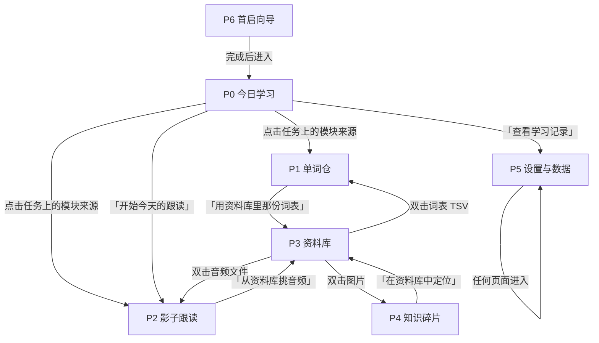

# TOPIK Study Hub 产品规格说明书

| 项 | 内容 |
|---|---|
| 文档名称 | TOPIK Study Hub 产品规格说明书 |
| 版本 | v1.14 |
| 日期 | 2026-10-09 |
| v1.1 修订 | 放开"永不联网"约束，改为"本地优先、联网增强"；新增 1.6 联网能力分层与第 12 章联网功能清单 |
| v1.2 修订 | 按实际使用习惯调整两个核心模块：P1 改为**两遍式背词**（过词 → 专攻，三态标记）；P2 改为**音频库 + 播放列表**。确认不做内嵌 AI 助手，改用快捷复制 |
| v1.3 修订 | 确定以 **Linear Desktop App** 为视觉参照，视觉规范移交 `design/DESIGN.md`；第 3 章精简为基调摘要 + 组件命名契约 + 交互反馈规范 |
| v1.4 修订 | **决策结案。** D1 定为「B + C，不做 A」，P0 指标行改为 今日完成 / 连续学习 / 本周进度 / 今日亮点（累计完成移至概览区）；D2~D16 及其余待确认项全部采用推荐默认值 |
| v1.5 修订 | **视觉与工程收尾。** 视觉改造 D-1~D-4 全部落地（`DESIGN.md` v1.5）；移除视图代码中全部模态框，错误改走行内 `Banner`；补齐 P1/P3/P4 空状态；新增 `tools/check_names.py`。附录 B 中已完成项已标注。**功能轨（第 2–8 期）仍未开始** |
| v1.6 修订 | **OCR 全线移除，词表改为 TSV 单一入口。** 删除 P1 的「从 PDF 提取」（`OCRWorker`）、P4 的「提取图片文字」（`ImageOCRWorker`）、P5 的「词表转换脚本路径」与 Tesseract 自查；`detect_ocr_script()` / `get_ocr_script_path()` 一并移除。识别移到工具之外完成，工具只接收用户提供的 TSV。理由见 4.2 的 `〔v1.6 实施裁定〕`；第 12 章 F5 因此失去前置 |
| v1.7 修订 | **词表有了出口。** 4.2 新增流程 G「删除词表」（只删第一层，`word_notes` 不动，删完重导笔记能回来）；顺带修掉模式切换按钮的选中态累积缺陷（Qt 的可选按钮不自动互斥，原实现只写当前一个）。见 §10 第 3 期的 `〔v1.7 实施补充〕` |
| v1.8 修订 | **资料库改了骨架（第 4 期）。** 6.2 的 `materials` / `material_tags` / `reading_progress` 三张表按 **path 关联**重写，并拆出 `material_usage`：原稿把标签与阅读进度挂在 `material_id` 上，与 D6"索引可以随时删掉重建、重建后按 path 重新关联"直接冲突（自增 id 重建一次就指向别的文件）。索引改为持久化 + 启动时增量扫描（D6 方案 C），排除规则由"路径含 `TOPIK_Study_Hub`"改为比对工具项目目录的绝对路径。见 §10 第 4 期 |
| v1.9 修订 | **知识碎片落了地（第 6 期）。** 6.2 的 `snippets` / `snippet_tags` 两张表建起来了（schema v8）：`snippets` 与 `audio_tracks` 同形——第一层元数据与第二层笔记混在一张表里，因此**整张进导出**（导出是逐表走的，丢掉 `title` 就是丢用户产出）。4.5 点名的那条边界缺陷（「启动即递归扫整个资料根找图片」）已修：图片清单改从 P3 的持久化索引读，本页不再走目录树。同时补上碎片标题、说明、标签，以及 P3 ↔ P4 的双向跳转 |
| v1.10 修订 | **联动打通了前半段（第 7 期）。** 5.1 闭环的「② 执行 → ③ 记录」原来只连了一半：P1 的过词与专攻从来不写活动日志，首页那张条永远只有跟读一项。本期补上 `vocab_triaged` / `vocab_drilled` 两条事件（按天合计，`Ctrl+Z` 会退回去），并按 **D1** 把 P0 指标行改成「今日完成 / 连续学习 / 本周进度 / 今日亮点」——「累计完成」降到新增的 H5 本周概览区。同时落地「继续上次」卡与「今日已自动记录」条。**本周回顾视图与 Anki 导出仍在本期未做。**见 4.1 的 `〔v1.10 实施裁定〕`、5.2、5.3 与 §10 第 7 期 |
| v1.11 修订 | **第 7 期与 D-5 全线收官（本地核心第 1–7 期全部完成）。** 补齐本周回顾 7 日条带（`week_summary()`）、跨词表待专攻总视图、Anki TSV 导出（P1/P5 双入口）；完成 D-5 视觉与交互收口：左侧栏 Logo 24px 物理断层 +「学习/资料」分组标题 + 像素级对齐线、P0 右上角考试倒计时模块化卡片、P1 过词/专攻居中实体卡片（周边低对比度词性/进度/例句笔记）与专攻单步回退、P2 空播放列表导入修复/移除视频转换/锁定录音参考音轨/录音目录快捷入口与新命名规则、P4 修改标题同步重命名磁盘文件（`relocate_file`）。见 §10 第 7 期与 `DESIGN.md` v1.8 |
| v1.14 修订 | **过词动效重做：从"整卡滑动"改为"分层错峰落位"。** 5.1 流程 B 第 5 条的「无动画」口径收窄为「不阻塞、无确认、无停顿」，并补 `〔v1.14 实施裁定〕` 记录正反两个实现。旧的整卡 14px 滑动在连按 `1`/`2`/`3` 时退化为"归位→瞬移→再滑"，是"跳脱"感的来源；新的编排只动序号/大字/释义三个内容叶子（0/20/50ms 错峰、8/18/12px、`OutCubic`，总量约 180ms），卡片外框、按钮、进度条恒定为锚，状态先落库文字先换好，输入绝不等动画。参数惟一出处为新增的 `ui/motion.py`，`components.LabelMotion` 负责打断重播与 effect 即挂即摘（常驻 effect 会让静止文字丢失亚像素抗锯齿而发虚）。Toast 出入场同步切换到令牌表（140ms 入 / 200ms 出，出场改 `InCubic`）。工程规则见 `CLAUDE.md` 微动效黄金法则第 5 条。 |
| 上游文档 | `docs/Toolkit_Design_Proposal.md`《韩语学习工具箱设计方案》 |
| 定位 | 将原始产品大纲扩展为可实现、可验收的完整规格 |
| 读者 | 产品决策者（本人）、实现者、后续任何接手该项目的人或 AI 实例 |

---

## 0. 文档说明

### 0.1 范围

本文档描述**产品应当是什么样的**，不描述**用什么代码实现**。涉及技术栈的部分只写约束（如"核心功能必须离线可用"），不写类名、函数名。

例外：第 6 章数据模型与第 3 章设计系统会给出具体的字段名与 token 名。这不是代码，而是产品语言——它们定义了"系统里有哪些概念"，实现者需要照着落地。

### 0.2 与《设计方案》的关系

原始大纲回答"这个工具要有哪五个模块、每个模块解决什么痛点"。
本文档回答"每个页面长什么样、用户怎么操作、数据怎么流动、出错怎么办、先做什么"。

原始大纲中的每一条功能需求，本文档都能追溯到；本文档新增的内容均带 `〔补充〕` 标记。

### 0.3 标注约定

| 标记 | 含义 |
|---|---|
| `〔补充〕` | 原始大纲中没有、由本文档新增的功能或要求 |
| `〔决策〕` | 存在多个合理方案，需在第 7 章对比后拍板 |
| `〔待确认〕` | 需要产品决策者回答的问题。**v1.4 起本章已全部结案**（见 11 章），此标记只用于今后新增的未决项 |
| `〔现状〕` | 描述当前代码已有的行为，用于区分"已实现"与"待实现" |

---

## 1. 产品定位

### 1.1 一句话定位

**一个单人使用、以本地资料文件夹为真相源的 TOPIK 备考工具箱——把散落在文件夹里的真题、单词表、录音和截图，变成一套能被记录、被回顾的学习流程。核心能力完全离线，联网只用来把部分环节做得更好。**

### 1.2 产品边界

这是全文档最重要的一节。边界之外的任何需求，无论多合理，都不属于本产品。

**产品要做的：**

- 让本地已有的资料**更好用**（找到、读懂、标注、记住读到哪里）
- 记录学习**行为**（今天背了多少、跟读多久、完成了什么）
- 把五个模块的学习数据**汇到一处**，形成"看得见的进步"

**产品明确不做的：**

| 不做 | 理由 |
|---|---|
| 自建云服务、账号体系、自动多设备同步 | 账号与同步服务器是另一个产品的基础设施。多设备迁移改用"导出到用户自己的网盘同步目录"解决（见 12.4） |
| 在线题库、自动判分、AI 出题 | 这是另一个产品。本工具处理的是"已有的本地资料" |
| 社交、排行榜、打卡分享 | 单人自用工具，外部激励不成立 |
| 从零编写教学内容的课程系统 | 内容是用户已有的；本工具是容器不是教材 |
| 替代 Anki / 记忆曲线算法 | 只做**导出**到 Anki，不做复习调度算法 |
| 多用户、多档案（多套账号各存一份数据） | 单机单人；多套档案只保留"导出备份"这一条出路 |
| 全格式文档编辑器 | 资料是只读的；工具只写"笔记"和"标注"，不改原文件 |
| 内嵌 AI 对话助手 / 语法讲解机器人 | 会把产品从"资料容器 + 学习记录"变成"AI 家教"，是定位级的改变。见 12.3 |
| 常驻在线服务／自建后端 | 联网功能一律由用户自带密钥直连第三方（BYOK），本工具不托管任何密钥、不运营任何服务器（见 1.6） |

**两条贯穿全部设计的铁律：**

1. **本工具绝不修改、移动、删除用户的资料文件。** 所有写入都发生在数据库或工具自己的产出目录中。
2. **联网功能默认全部关闭，且绝不在任何用户数据上"悄悄"外传。** 每个联网功能都必须明确告知会把什么内容发送给谁（见 12.5）。

### 1.3 用户画像与备考场景

**用户：** 备考第 109 届 TOPIK 中高级的韩语学习者。已有大量积累的本地资料（历届真题 PDF、扫描版单词表、OBS 录制的听力音频、讲义、零散截图），具备一定电脑操作能力，能接受手动放置文件，但不希望为了学习去折腾软件。

**典型备考节奏（由此推导全部设计）：**

| 时段 | 场景 | 对应模块 |
|---|---|---|
| 每日开始 | 打开工具，看倒计时，定今天要做的两三件事 | P0 今日学习 |
| 单词时间 | 导入一份扫描版单词表 → 转成可查表格 → 标重点、写联想 | P1 单词仓 |
| 听力时间 | 打开音频 + 韩中对照文本 → 单句 AB 循环跟读 | P2 影子跟读 |
| 做题/翻讲义 | 快速找到"上周做过的 91 届阅读讲义"，打开继续看 | P3 资料库 |
| 随时 | 看到好的知识点截图 → 收集 → 需要时回顾 `〔v1.6 措辞〕`（原为"需要时 OCR 出文字"） | P4 知识碎片 |
| 周末 | 回顾这一周做了什么，调整下周计划 | P0 回顾区 / 〔补充〕周视图 |

**由此确认三个高频动作，它们的效率决定整个产品的成败：**

1. **找到一份资料**（P3）
2. **打开一段音频并开始跟读**（P2）
3. **记录"我做完了"**（P0）

任何新增功能如果让这三个动作变慢，就是负收益。

### 1.4 设计原则

| #   | 原则                 | 具体含义                                       |
| --- | ------------------ | ------------------------------------------ |
| P1  | **本地优先，联网增强**      | 核心功能在断网时完全可用；联网只用来把部分环节做得更好。每个联网功能必须有离线等价路径或明确的"离线不可用"标注，默认关闭、需显式开启。见 1.6 与第 12 章。 |
| P2  | **零配置启动**          | 首次打开即可用。资料目录自动探测，考试日期给出合理默认值。配置项存在但不必填。    |
| P3  | **不打断学习流**         | 耗时操作（转码、索引）后台执行且可以离开页面；记录学习数据自动完成，不弹确认框。  `〔v1.6〕`原并列的 OCR 已移除 |
| P4  | **不丢失用户产出**        | 笔记、重点、标签、进度、任务——这些无法从源文件重建的数据，必须持久化并可一键导出。 |
| P5  | **失败要可理解、可恢复**     | 出错时告诉用户"发生了什么 + 我能做什么"，而不是抛一个英文异常或静默失败。    |
| P6  | **资料文件只读**         | 见 1.2 铁律。                                  |
| P7  | **记录是为了回顾，不是为了打卡** | 所有统计都服务于"我该怎么调整"，不做廉价的成就感动画。               |

### 1.5 体验目标

| 目标 | 验收方式 |
|---|---|
| 冷启动到可操作 ≤ 3 秒（资料库万级文件规模下） | 手动计时 |
| 从打开工具到"今天第一个任务被勾选" ≤ 30 秒 | 观察首次使用 |
| 找到一份已知名称的资料 ≤ 3 次交互 | 走查 |
| 开始跟读一段音频 ≤ 4 次交互（选择文件 + 播放） | 走查 |
| 任何错误状态都有中文说明+至少一个可操作出口 | 遍历第 8 章矩阵 |

**非目标：** 不做留存率、日活、分享率这类需要多用户的指标。单人工具的成功标准是"用户每周仍然在用它"。

### 1.6 联网能力分层 〔补充〕

放开"永不联网"约束不等于放弃本地优先。**本地优先是架构，联网是可选的一层能力。** 所有功能按下面三层归类：

| 等级 | 定义 | 离线行为 | 允许的数量 |
|---|---|---|---|
| **L0 · 离线核心** | 产品的主干能力 | 完整可用，无任何功能损失 | 不限，**这是产品的绝大部分** |
| **L1 · 联网增强** | 有离线等价路径，联网让结果更好或更快 | 自动退回离线路径，质量下降 | 鼓励。**联网功能的首选形态** |
| **L2 · 联网专有** | 没有离线等价物 | 不可用，入口置灰并说明原因 | **必须极少**，且必须显式标注 |

**三条规则：**

1. **L0 的名单是固定的**：P0 的任务与倒计时、P1 的词表导入与笔记、P2 的播放与 AB 循环、P3 的查找与打开、P4 的碎片收集与查看 `〔v1.6〕`（原为"P4 的本地 OCR"）、P5 的全部设置与备份。**这些能力永远不会被改成依赖网络。**
2. **能做成 L1 就不要做成 L2。** 例：单词发音优先用系统本地的韩语语音，联网 TTS 只作音质增强（见 12.1 F3）。这条规则的效果是：断网时产品依然完整，只是"没那么好"。
3. **每一个联网开关都要说清楚代价。** 在 P5 打开某个联网功能时，必须当场显示"此功能会把〔什么内容〕发送到〔哪个服务〕"。不接受一句笼统的"需要联网"。

**架构前提：不做自建后端（BYOK）。**

本工具没有服务器，也不打算有。所有联网功能一律**由用户自带密钥、从本机直连第三方服务**。这条前提带来三个直接后果，都是好的：

- 不存在"你的学习数据经过我的服务器"这种情况——没有任何中间方
- 密钥只存在本机，工具不保管、不上传
- 服务选型可以随时更换，不会因为某个服务下线而让产品失效

代价是用户需要自己去申请密钥。因此**L1/L2 功能一律不得成为主线流程的必经环节**——不配密钥的用户，产品照样完整可用。

各联网功能的具体清单、数据出境范围与成本见 **第 12 章**。

---

## 2. 信息架构

### 2.1 全局框架

单窗口、固定左右结构，永不新开窗口（模态对话框除外）：

```
┌──────────────┬──────────────────────────────────────────────┐
│              │                                              │
│   侧边栏      │              内容区                          │
│  224px 固定   │         （QStackedWidget，一次只显示一页）      │
│              │                                              │
│  ┌────────┐  │  ┌────────────────────────────────────────┐  │
│  │ 品牌区  │  │  │  页头：眉标 / 标题 / 副标题 / 右侧信息    │  │
│  └────────┘  │  └────────────────────────────────────────┘  │
│  ┌────────┐  │  ┌────────────────────────────────────────┐  │
│  │ 导航项  │  │  │                                        │  │
│  │  今日   │  │  │            页面主体                     │  │
│  │  词     │  │  │                                        │  │
│  │  听     │  │  │                                        │  │
│  │  库     │  │  │                                        │  │
│  │  记     │  │  │                                        │  │
│  └────────┘  │  └────────────────────────────────────────┘  │
│  ┌────────┐  │                                              │
│  │ 页脚   │  │                                              │
│  └────────┘  │                                              │
└──────────────┴──────────────────────────────────────────────┘
```

**侧边栏内容（自上而下）：**

1. 品牌区：`TOPIK / Study Hub` 标题 + 一句副标题
2. 导航列表：五个模块，每项 = 单字标记 + 名称

   | 标记 | 名称 | 页面 ID |
   |---|---|---|
   | 今天 | 今日学习 | P0 |
   | 词 | 智能单词仓 | P1 |
   | 听 | 影子跟读 | P2 |
   | 库 | TOPIK 资料库 | P3 |
   | 记 | 知识碎片 | P4 |

3. 底部：设置入口 〔补充〕+ 页脚说明文案

**导航行为：**

- 点击切换页面，内容区整体替换。**不做页面切换动画**（P3：不打断，动画只会让高频切换变慢）。
- 导航项需要携带**状态徽标** 〔补充〕：如"今日学习"显示未完成任务数、"影子跟读"显示当前正在跟读的曲目名（截断）、"智能单词仓"显示待专攻词数。徽标让用户在不切换页面的情况下知道其他模块的状态。上限 1 个数字徽标/文字徽标，不做堆叠。

### 2.2 页面清单

| ID | 页面 | 目的 | 优先级 |
|---|---|---|---|
| P0 | 今日学习 | 聚合今日状态、管理当日任务、给出下一步行动 | 已有，需强化 |
| P1 | 智能单词仓 | 把扫描版词表变成可查、可标、可备注的电子词库 | 已有，需重构 |
| P2 | 影子跟读 | 音频与双语文本同屏，支持 AB 循环与变速 | 已有，需完善 |
| P3 | TOPIK 资料库 | 在本地资料中快速找到并打开目标文件 | 已有，需重构 |
| P4 | 知识碎片 | 收集零散截图，随时回顾 | 已有；**OCR 已移除（v1.6）**，原列"随时 OCR 取字" |
| P5 | 设置与数据 | 配置考试日期、资料目录、快捷键、联网开关；导出备份 〔补充〕 | 新增 |
| P6 | 首次启动向导 | 三步完成初始化 〔补充〕 | 新增 |

### 2.3 页面关系图

页面之间**允许跳转**（这是形成"闭环"的关键，原始大纲的"模块联动追踪"依赖它）：



**跳转通则：**

- 跨页跳转必须**携带上下文**，不能只是切页面。例：从 P0 点击跟读任务的来源，应切到 P2 并载入那条音轨。
- 目标页面完成后，**返回原页面**应当是一步操作（提供"返回今日学习"的轻量入口，或依赖侧边栏 P0）。
- 跳转后目标页面的状态**不得重置**（P2 正在播放的音频不会因为跳去 P3 再回来而停止——见 4.3 状态保持）。

### 2.4 跳转矩阵

| 从 \ 到 | P0 | P1 | P2 | P3 | P4 | P5 |
|---|---|---|---|---|---|---|
| **P0** | — | 任务来源 | 任务来源 / 快捷入口 | ○ | ○ | 记录区 |
| **P1** | ○ | — | ○ | 导入源 | ○ | ○ |
| **P2** | ○ | ○ | — | 选音频 | ○ | ○ |
| **P3** | ○ | 双击 .tsv | 双击音频 | — | 双击图片 | ○ |
| **P4** | ○ | ○ | ○ | 定位来源 | — | ○ |
| **P5** | 返回 | 返回 | 返回 | 返回 | 返回 | — |

`○` = 通过侧边栏可达；具体文字 = 有显式入口。

### 2.5 全局状态与上下文

跨页面共享的上下文（切页不丢失）：

| 上下文 | 说明 | 谁写入 | 谁读取 |
|---|---|---|---|
| **当日日期** | 全系统统一的"今天" | 系统时钟 | P0 任务、活动记录 |
| **当前音频** 〔v1.2 修订〕 | 正在跟读的**播放列表 + 曲目 + 播放位置 + AB 点 + 语速** | P2 | P3（标记"在读"）、P0（继续上次） |
| **当前词表与过词进度** 〔补充 v1.2〕 | 正在过的词表、断点位置、待专攻计数 | P1 | P0（今日学习可显示"还有 87 个词待专攻"）、P3 |
| **当前词表** | 正在浏览的词表及其滚动位置 | P1 | P3 |
| **资料根目录** | 用户配置的本地资料所在位置 | P5 / P6 | P3、P4、P1 |
| **考试信息** | 届次名称 + 考试日期 | P5 / P6 | P0 倒计时 |

`〔补充〕` **"继续上次"机制**：P0 增加一张卡片，把两个"未完成的上下文"变现——

- 若**当前音频**存在且未听完：`继续跟读《91届听力精讲》第 4 段 · 上次听到 12:34`，一键回到 P2 的原列表、原曲目、原位置
- 若**当前词表**有过词断点或待专攻词：`词表《91届听力单词1400》· 已过 320/1400，87 个待专攻`，一键回到 P1 继续

这是把上下文变现的关键设计——它让学习可以跨天接续，而原始大纲没有覆盖"隔天继续"这个真实场景。

### 2.6 全局导航与快捷键 〔补充〕

原始大纲的"全局快捷键截图"提示了快捷键需要体系化，而非零散定义。

| 快捷键 | 作用 | 生效范围 |
|---|---|---|
| `Ctrl+1` ~ `Ctrl+5` | 切到 P0~P4 | 全局 |
| `Ctrl+,` | 打开 P5 设置 | 全局 |
| `Ctrl+F` | 聚焦当前页搜索框 | 有搜索的页面 |
| `Space` | 播放 / 暂停 | 仅 P2，且输入框未聚焦时 |
| `A` / `B` / `C` | 设置 A 点 / B 点 / 清除 | 仅 P2 |
| `←` / `→` | 后退 / 前进 3 秒 | 仅 P2 |
| `Ctrl+←` / `Ctrl+→` 〔v1.2〕 | 上一段 / 下一段 | 仅 P2 |
| `Ctrl+Shift+C` 〔v1.2〕 | 复制选中句（韩语 + 中文对照） | P2 |
| `1` / `2` / `3` 〔v1.2〕 | 认识 / 模糊 / 不认识 | 仅 P1 过词与专攻模式 |
| `Ctrl+Z` 〔v1.2〕 | 退回上一个词（过词判错） | 仅 P1 过词模式 |
| `Ctrl+K` | 全局快速查找（资料 / 单词）〔补充〕 | 全局 |
| `Ctrl+S` | 保存当前笔记 | 有笔记编辑区的页面 |

**设计约定：**

- 单字母快捷键（`A`/`B`/`C`/`Space`）**必须在文本输入框聚焦时自动失效**，否则用户打字会触发播放控制。这是极易踩的坑，明确列为验收项。
- 快捷键必须可在 P5 查看（至少只读展示）。**〔v1.4 已定〕不做自定义**（Q4）——先观察实际使用中哪些键真的需要改，再决定是否投入。

---

## 3. 设计系统

> **本章已精简。视觉规范的完整内容见 `design/DESIGN.md`（v1.0）。**
> 那里定义了色板、字号、间距栅格、圆角、边框、图标与组件改造清单，并以 Linear Desktop App 为参照。
> 本章只保留**与产品行为相关**的部分，以及**组件命名契约**（实现与规格对齐用）。

### 3.1 视觉基调（摘要）

**深色、克制、高密度、无装饰**，参照 Linear Desktop App 的视觉语言：近黑底、1px 边框承担层级、几乎无阴影、小圆角、单一强调色且面积极小、单色线性图标。

三条不可违背的纪律（完整规则见 `DESIGN.md` 第 1、3 章）：

1. **每屏最多一个实心强调色元素**，且单个面积 < 2% 屏幕。禁止大面积彩色填充。
2. **层级由边框与底色的极小阶差承担，不用阴影、不用大字号差。**
3. **状态色永远伴随图标或文字**，颜色只是冗余信息，不单独承载语义（与 9.3 一致）。

**已确认的视觉决策：**

| 项 | 决定 | 见 |
|---|---|---|
| 参照对象 | Linear 桌面端。**只取视觉语言，不取其页面结构与业务内容** | `DESIGN.md` §1 |
| 强调色 | **保留绿色身份**，不改为 Linear 的靛蓝——移植的是"强调色几乎不出现"的纪律，不是具体色相 | `DESIGN.md` §3.0 |
| 阴影 | 保持无阴影（现状已符合），不要用投影替代边框 | `DESIGN.md` §3.4 |
| 图标 | 拆除全部 emoji，改用 16px 单色线性图标（Lucide） | `DESIGN.md` §3.5 |
| 韩文字号 | 正文 15px，**高于中文字号一档**（韩文笔画更密集，深色底尤甚） | `DESIGN.md` §3.2 |
| 主题数量 | **本轮只做深色**。色值按语义命名，为将来加浅色留结构 | `DESIGN.md` §6.2 |
| 与重构计划的关系 | 视觉改造**插在第 2 期之后、第 3 期之前**，避免把界面写两遍 | `DESIGN.md` §5.2 |

**已知能力边界：** Qt/QSS 无过渡动画、无背景模糊、无精细阴影。`DESIGN.md` §5.3 列明了哪些 Linear 效果不移植，方案不依赖其中任何一项。

### 3.2 组件命名契约

组件**命名**沿用 `objectName` 语义，是规格与实现的接口。视觉形态见 `DESIGN.md` §4，此处只登记**有哪些组件、各需哪些状态**（状态是行为要求，不是视觉要求）。

| 组件名 | 用途 | 状态要求 |
|---|---|---|
| `surface` | 卡片、面板 | 默认 |
| `metricCard` | 指标卡（说明 + 数值） | 默认 / 空值（显示 `—` 而非 `0`） |
| `pageEyebrow` / `pageTitle` / `pageSubtitle` | 页头三级 | 默认 |
| `sectionTitle` | 卡片内小标题 | 默认 / 右侧带计数或操作 |
| `primaryButton` | 主按钮 | 默认 / 悬停 / 按下 / **禁用** / **加载中** |
| `iconButton` | 次级按钮 | 同上 |
| `dangerButton` | 危险操作 | 默认 / 二次确认态 |
| `textField` | 单行输入 | 默认 / 聚焦 / **错误** |
| `searchField` | 带清除按钮的搜索框 | 默认 / 有关键词（显示 ✕） |
| `checkBox` | 复选框 | 未选 / 已选 |
| `emptyState` | 空状态 | 见各页定义 |
| `banner` | 横幅提示条 | info / warning / danger / success |
| `progressInline` | 行内进度指示 | 不确定进度（转码） / 确定进度 |
| `tag` | 标签胶囊 | 默认 / 可删除 / 可选中过滤 |
| `toast` | 轻提示 | success / danger，2.5 秒自动消失 |
| `switchField` | 功能开关 + 一句话说明 | 关 / 开 / **开但未配置**（密钥缺失） |
| `keyField` | 密钥输入（掩码 + 「测试连接」） | 默认 / 已填写 / 校验中 / 校验失败 |
| `egressNotice` | 数据出境提示条 | 固定文案结构：`会把〔内容〕发送到〔服务〕`；用于开关开启前与执行前 |

`〔补充〕` **原始大纲完全没有定义空状态、加载状态、错误状态与提示组件**，而这三类状态恰恰是"用起来是否舒服"的分水岭。上面 `emptyState` / `banner` / `toast` / `progressInline` 四个组件是为此新增的必备基建。

### 3.3 交互反馈规范

本节描述**行为**（何时反馈、反馈强度），视觉形态见 `DESIGN.md`。

| 场景 | 规范 |
|---|---|
| 操作耗时 < 200ms | 无任何提示，直接完成 |
| 操作耗时 200ms ~ 2s | 按钮进入加载态（禁用 + 文字变化） |
| 操作耗时 > 2s（转码、索引） | 行内进度指示 + 可离开页面 + 完成后 toast 通知 |
| 破坏性操作（删除任务、删除标签、清空笔记） | 二次确认；任务类小对象可用"撤销"替代确认 |
| 成功 | toast，2.5 秒消失，不阻塞 |
| 失败 | 行内 `banner`（danger）+ 一句可操作的下一步；不弹模态框，除非必须用户立即决策 |
| 后台任务完成但用户已离开该页 | 在侧边栏对应导航项上显示徽标，用户回来时可见结果 |

**模态对话框的使用门槛：** 只有"必须用户立即决策否则无法继续"时才用模态。`〔v1.6〕`原举例"OCR 失败用模态弹窗（`QMessageBox.critical`）"已不存在——OCR 整体移除，且 v1.5 起全部视图代码已无 `QMessageBox`。**该门槛本身仍然有效**：用户此刻可能正在做别的事，弹窗是打断（违反 P3）。

`〔v1.4 实测证据〕` **这条不只是体验问题，它已经实际掩盖了一个功能性缺陷。**

2026-10-06 在补测试样例时，P1 载入词表会**永久卡死**。追查发现是两层叠加：

1. `core/database.py` 的 `get_word_state()` 把参数写成了字符串（`self._word_key(...)`）而非元组。sqlite3 会把字符串当字符序列展开，导致 `Incorrect number of bindings supplied` —— **`标记为重点` 与 `个人笔记` 自阶段 5 落地起从未成功执行过**（实测数据库中 `word_states` 表为 0 行，印证了这一点）。
2. `load_tsv()` 的 `except Exception` 把这个 `ProgrammingError` 吞掉，转交给 `QMessageBox.critical()`。无事件循环时该模态框**永久阻塞**，用户看到的是"卡死"，看不到任何错误信息。

**结论：** `except Exception` + 模态框的组合，会把"一个拼写级的小错"变成"无信息的死锁"。这条应作为 D-4 的实施依据——错误必须**行内可见**，且**不得吞掉编程错误**（`NameError`/`TypeError`/`ProgrammingError` 属于缺陷，不属于"用户操作失败"）。

**无过渡动画：** Qt/QSS 不支持过渡，悬停/聚焦反馈为**瞬时**变色。这是平台限制，不作为缺陷处理。

---

## 4. 页面规格

以下每页采用统一结构：**目的 → 信息层级 → 核心组件 → 用户操作流程 → 状态（空/加载/错误）→ 数据依赖 → 页面关系 → 扩展方向**。

---

### 4.1 P0 · 今日学习

#### 目的

回答用户每天打开工具时的三个问题：**"我还有多久考试？" "我今天该做什么？" "我昨天/这周做得怎么样？"** 并成为通往其他模块的枢纽。

设计意图：它是**仪表盘**，不是**任务清单**。任务清单只是仪表盘上的一块。

#### 信息层级

```
H1  页头：日期眉标 + 主标题 + 副标题 + 右侧倒计时
H2  指标行：四张指标卡（今日完成 / 连续学习 / 本周进度 / 今日亮点）
H3  主卡片：今日任务
H4  侧栏卡片 〔补充〕：继续上次 / 今日已自动记录
H5  底部 〔补充〕：本周概览（折叠或次屏，含累计完成 〔v1.4〕）
```

**层级判断依据：** 倒计时必须在 H1 且视觉显著（原始大纲明确要求"固定展示、增加紧迫感与仪式感"）；指标行是"我做得怎么样"的一秒可读区；任务区是唯一需要交互的区域，占据最大面积。

#### 核心组件

| 组件 | 内容 | 备注 |
|---|---|---|
| 倒计时 | `距 第 109 届 TOPIK 考试 还有 N 天` | 数据来自设置表；日期未配置时显示提示而非错误 |
| 指标卡 ×4 | 今日完成 `2 / 5`、连续学习 `7 天`、**本周进度** `3 / 7 天`、**今日亮点** `24 分钟`（副标 `今日亮点 · 跟读`） | 卡 3、4 见 D1；**四张卡全部是纯事实数字，不做行动建议** 〔v1.4〕 |
| 任务输入行 | 单行输入 + 「添加任务」主按钮 | 回车即添加 |
| 任务列表 | 复选框 + 任务标题 + 删除按钮 | 每行左侧或右侧显示来源模块标记 〔补充〕|
| 任务计数 | `N 项待办` | 卡片右上角 |
| 继续上次卡 〔补充〕 | `继续跟读《文件名》· 上次听到 12:34` | 仅有未完成音频时出现 |
| 自动记录条 〔补充〕 | `今日已记录：跟读 24 分钟 · 过词 320 个 · 专攻通过 12 个` | 只读，证明"数据在自动沉淀" |

**四张卡的定义** 〔v1.4 已定，见 D1〕：

- **今日完成 / 连续学习**：不变（口径见 5.4）
- **本周进度**：本周有学习的自然日数 / 7，每周一重置
- **今日亮点**：取今日活动日志中**投入量最大**的一项，显示为大数值 + 来源（如 `24 分钟` / `今日亮点 · 跟读`）。**无活动时显示 `—`，不显示 `0`**
- **「累计完成」不再占首屏卡位**，移入 H5 本周概览区

**与「今日已自动记录」条的分工**（避免看起来重复）：卡是**一眼看到的那一条**（今日最大投入），条是**完整清单**（跟读 24 分钟 · 过词 320 个 · 专攻通过 12 个）。前者给情绪，后者给事实与跳转入口。

`〔v1.10 实施裁定〕` 本期落地后，有三处要写清楚：

1. **「今日已自动记录」条放在主列（任务卡下方），不在 H4 的侧栏里。** H4 把它与「继续上次」并列为"侧栏卡片"，但 5.3 给它的格式是**一行**，而侧栏只有 300px 宽——硬塞进去必然折成三行，"一条"就不再是一条。**以 5.3 的格式定位置**：条留在主列（全宽，一行放得下），侧栏只放「继续上次」。侧栏没有可继续的上下文时**整列隐藏**，让任务卡占满整宽。
2. **条上只出现三类事件。** 5.2 的事件表里，展示位置写了"P0「今日已自动记录」"的只有 `shadowing_minutes` / `vocab_triaged` / `vocab_drilled`；`material_opened` 明写"不展示（仅用于高频排序）"，`task_completed` 明写展示在"连续学习天数、累计完成"。所以两者都不上这条——而任务就在正上方的任务卡里，再列一遍是重复。
3. **「继续上次」里音频的判据是"真的听过"，不是"选过一次"。** `playback_state` 在**切曲那一刻**就会写，只拿它的存在做判据，仅仅点开看一眼的曲目会立刻出现在「继续跟读」里。判据取 `listened_ms > 0`（4.3 的"时长归曲目"）且未标成已磕完。**不用 `position_ms > 0` 代替**：位置是**可以回零**的（从头重听、或冲刷时播放器还没有有效 source），而"听过多久"只增不减。位置为 0 时照实显示 `上次听到 0:00`，不另造说法。

**关于那"一处温度"。** D1 说「本周进度」与「今日亮点」承接了 `DESIGN.md` §6.1 方案 B 里那"一处温度"的位置。本期是按**内容**承接的：两张卡是纯事实的正向反馈（"今天做得不错""这周状态还行"），**视觉上的强调色一个都没多加**——指标行仍只有卡 2（连续学习）那一处 `metricValueAccent`（`DESIGN.md` §3.6 B 定的），加上倒计时那处 `accent-warm`（§6.1 明写`accent-warm` 只给倒计时）。四张卡都上色就等于都没上色（§3.1 第 1 条）。若验收时觉得右端两张卡该有自己的颜色，改的是这一条。

#### 用户操作流程

**流程 A：添加并完成第一个任务（首次使用主路径）**

1. 用户进入 P0，看到倒计时与全为 0 / 空的任务列表
2. 空状态提示引导："今天还没有任务。先写下最想完成的一件事吧。"（当前实现已有）
3. 用户点击输入框，输入"精听第 91 届第 12 题"
4. 回车 → 任务出现在列表顶部，计数变为 `1 项待办`
5. 用户完成后勾选复选框 → 复选框置为选中态，指标卡"今日完成"由 `0 / 1` 变为 `1 / 1`
6. 任务记录写入活动日志，连续学习天数 +1

**流程 B：跨天接续学习** 〔补充，解决原始大纲未覆盖的场景〕

1. 用户昨天在 P2 跟读了一段音频，中途关闭
2. 今天打开 P0，看到"继续上次"卡片
3. 点击 → 切到 P2，音频自动载入并定位到上次位置
4. 用户继续跟读

**流程 C：从任务跳到模块**

1. 任务"精听第 91 届第 12 题"带有来源标记 `听`
2. 用户点击该标记 → 切到 P2 并定位到对应音频（若可关联）
3. 完成后返回 P0

#### 状态

| 状态 | 表现 |
|---|---|
| **空（无任务）** | 隐藏任务列表，显示居中空状态文案 + 输入行保持可用（关键：空状态必须引导下一步动作，而不是只说"没有数据"） |
| **空（有任务但都没完成）** | 指标卡显示 `0 / N`；今日亮点无活动时显示 `—` 〔v1.4〕 |
| **加载** | 本地 SQLite 查询 < 10ms，无需加载态 |
| **错误（考试日期格式非法）** | 倒计时位置降级为只显示届次名称，不显示天数；不弹错 |
| **错误（数据库不可读）** | 整页显示 `banner`(danger)：`学习记录无法读取。已备份原文件到 data/backup/，正在使用新的空白记录。` + "重试"按钮 |
| **边界（初次使用，日期为默认值）** | 倒计时正常显示默认值，并在设置入口处显示一个提示点 〔补充〕，引导用户确认日期 |
| **边界（考试日期已过）** | 显示 `考试已结束` 而非"还有 -5 天"（当前实现用 `max(days, 0)` 规避了负数，但语义上是错的） |

#### 数据依赖

- 读：`settings`（exam_date / exam_label）、`tasks`（当日）、`activity_log`（当日与历史）、当前音频上下文
- 写：`tasks`（增删改）、`activity_log`（任务完成时写入）

#### 页面关系

- **入口**：首启向导完成后、侧边栏首项、`Ctrl+1`
- **出口**：任意模块（通过侧边栏或任务来源标记）、P5（学习记录）

#### 扩展方向

- 本周/本月回顾视图（热力图式学习天数）
- 任务模板（"每天固定三件事"一键生成）
- 任务与模块的强关联（勾选任务自动触发对应模块的记录）
- 考试日程自动同步（联网增强 **F1**，见第 12 章）

---

### 4.2 P1 · 智能单词仓

#### 目的

解决原始大纲的核心痛点：**扫描版/图片版单词表无法复制、无法标记。** 最终形态是一个"可查、可标、可备注、可导出"的个人电子词库。

**关键定位判断：** 这个页面的价值不在"显示单词"，而在**用户在这个词上留下的东西**（标记、联想笔记）。因此设计上必须保证：换个词表、重开工具、甚至换台电脑，这些痕迹都还在。

`〔补充 v1.2〕` **核心使用方式是"两遍式"的，这决定了整页的形态。**

用户真实的背词习惯是：

```
第一遍「过词」  快速浏览整个词表 → 只做一个判断：认识 / 不认识
                              ↓ 被标出来的词成为"待专攻"
第二遍「专攻」  只回来攻这些词 → 看释义、写笔记、再判一次
                              ↓ 判为"认识"即出列
                 循环，直到待专攻清空
```

**由此推出一条硬性设计约束：过词时不能是表格。** 表格适合"查"和"整理"，但不适合"过"——一屏几十个词，眼睛会乱跑，也会被已经认识的词干扰。过词必须**一次只呈现一个词、一次只做一个判断**。

因此 P1 有三个模式：**浏览**（表格，用于查与整理）、**过词**（单卡快判）、**专攻**（单卡，只过被标记的词）。

#### 信息层级

```
H1  页头：标题 + 副标题 + 词表选择器 〔补充 v1.2〕
H2  操作条：模式切换（浏览 / 过词 / 专攻）+ 导入入口 + 搜索框
H3  浏览模式
    ├─ 词表元信息条：词表名 · N 个词 · 已过 X · 待专攻 M
    └─ 词条表格（左 2/3）：编号 / 韩语 / 中文释义 / [状态]
H4  单词详情卡（右 1/3）：主词 / 释义 / 笔记 / 来源
H5  过词模式（整屏）
    ├─ 进度：`本次已过 320 / 1400 · 已标记 87`
    ├─ 当前词（居中大字韩语；释义按 D14 决定是否先遮住）
    └─ 三个动作：认识 / 模糊 / 不认识
H6  专攻模式（整屏）
    ├─ 进度：`本轮剩 42 · 累计待专攻 87`
    ├─ 当前词 + 释义（展开）+ 笔记编辑区
    └─ 动作：认识了（出列） / 还是不会（留在本轮）
```

**层级判断依据：** 浏览模式的表格是主工作区，必须最大；详情卡是"停下来思考"的区域，宽度固定即可。过词/专攻是**全屏接管**的模式——它们要求注意力集中，任何侧栏都是干扰。

#### 核心组件

| 组件 | 内容 | 备注 |
|---|---|---|
| 词表选择器 〔补充 v1.2〕 | 下拉，列出已导入的全部词表 | 决定了后面所有模式的作业范围 |
| **模式切换** 〔补充 v1.2〕 | 浏览 / 过词 / 专攻 三段控件 | 浏览=表格；过词=单卡快判；专攻=只过标记词 |
| 导入 TSV 按钮 | 打开文件选择器，默认定位到上次导入目录 | 次级按钮样式；**〔v1.6〕是词表的唯一入口** |
| 删除词表按钮 〔v1.7 补充〕 | 删除当前选中的词表，见流程 G | `dangerButton` 危险色；选中「全部词表」时禁用（那里没有可删的行） |
| ~~导入 PDF（OCR）按钮~~ | ~~选择扫描 PDF → 调用外部 OCR 脚本~~ | **〔v1.6 已移除〕**，见流程 A 的裁定 |
| ~~进度提示~~ | ~~OCR 过程中的行内进度~~ | **〔v1.6 已移除〕**，已无长耗时操作 |
| 搜索框 | 韩文/中文双向检索，实时过滤 | 大小写不敏感；仅浏览模式 |
| 词表元信息条 〔补充〕 | 词表名 · 总数 · **已过 X** · **待专攻 M** | v1.2：从"重点数"扩展为两遍流程的进度 |
| 词条表格 | 三列 + 状态列 | 待专攻词行底色 `state-starred` |
| 单词详情卡 | 主词 + 释义 + 笔记 + 来源 | 见下 |
| 笔记编辑区 | 多行文本 | 需自动保存 〔补充〕 |
| 状态切换按钮 〔v1.2 修订〕 | 认识 / 模糊 / 不认识 三态切换 | 原"标记为重点"的二元开关不够用，见流程 C/D |
| **过词卡** 〔补充 v1.2〕 | 居中大字韩语 + 释义（遮或不遮见 D14）+ 三个动作按钮 | 一次只显示一个词 |
| **过词进度** 〔补充 v1.2〕 | `本次已过 320 / 1400 · 已标记 87` + 细进度条 | 中途退出保留断点 |
| **专攻卡** 〔补充 v1.2〕 | 当前词 + 展开的释义 + 笔记编辑区 + 两个动作 | 这一遍是学习，不是测试，故释义默认展开 |
| **专攻计数** 〔补充 v1.2〕 | `本轮剩 42 · 累计待专攻 87` | 让"还剩多少"始终可见 |

**键盘优先（过词/专攻的成败在这里）：** 过词时手不应离开键盘。`1`/`2`/`3` = 认识/模糊/不认识，`Space` = 下一个，`Ctrl+Z` = 退回上一个词（判错了要能改）。所有动作按钮上都要显示对应的按键提示。

> `〔v1.5 实施裁定〕` **本节与 D14 冲突，已按 D14 落地。** 这里写 `Space = 下一个`，D14 写 `Space = 可临时揭示` 释义——两者不能同时成立。裁定取 D14，理由：
> 判断动作本身**立即跳到下一个词**（流程 B 第 5 条："无动画、无确认、无停顿"），
> 所以"下一个"这个键没有独立职责，按了也无事可做；而揭示释义是 D14 论证过的核心机制
> （"两遍式流程的全部价值建立在第一遍的标记准确之上"）。实现在 `ui/vocab_view.py`：
> `Space` 在**过词模式**切换释义可见性，专攻模式下释义本来就展开，该键被禁用。
>
> 顺带记两条实施补充：`1`/`2`/`3` 在专攻模式下也有映射（`1` = 认识了，`2`/`3` = 还是不会）；
> 两个模式的键盘接管都**不得抢走文本输入**——笔记区或搜索框聚焦时全部让开，
> 否则用户写笔记时按 `1` 就会把词判出去。

`〔补充〕` **自动保存笔记**：当前实现是切换到另一个词时才保存上一个词的笔记（`save_current_word`），用户如果直接关闭工具，正在编辑的笔记**会丢失**。这违反原则 P4。规格要求：笔记内容变化后 1.5 秒防抖自动保存，并在详情卡角落显示 `已保存` / `保存中` 的极轻提示。

#### 用户操作流程

**流程 A：导入词表（核心流程）** `〔v1.6 重写〕`

1. 点击「载入词表」
2. 选择一份 TSV（三列、制表符分隔：`编号 / 韩语 / 中文`；格式契约见 `samples/README.md`）
3. 逐行解析 → 入库；列数不足或韩语列为空的行**跳过**，提示里报出跳过条数
4. 表格填满词条；若该词表此前以**同一路径**导入过，**自动恢复所有历史笔记、过词状态与断点** 〔补充，关键〕

> `〔v1.6 实施裁定〕` **原流程 A 是"导入扫描版 PDF → OCR → 生成 TSV → 载入"，已整条删除；识别移到工具之外完成。**
> 三条实测理由记在这里，避免日后"顺手再把 OCR 加回来"：
>
> 1. **外部转换脚本对目标版面命中率为 0。** `单词表转文本PDF工具.py`（**测量之后已被删除**，故该证据无法再对着现存文件复核）
>    在 `_ocr_image_words()` 里硬编码
>    `--psm 6`（"假定单一均匀文本块"），而词表恰恰是**双栏表格**。用手工校对过的 50 词真值比对：
>    200 / 300 / 400 DPI 下命中 **0/50**；换 `--psm 3`/`4` 才有 64–72%。解析器从未拿到过可用输入。
> 2. **一半的源词表 PDF 根本不是扫描件。** 96届那几个 `_学习用.pdf` 带完整文字层，`fitz.get_text()`
>    直接给出全部 50 行、零误差；走 OCR 反而毁掉这份精度——实测该文件用 OCR 只得 **0 条**。
> 3. **单一入口消掉一整类维护成本。** 识别在工具之外做，工具里就没有第二条识别路径需要与 TSV 格式同步，
>    也不必再持有并检测 Tesseract 依赖（P5 的自查、P4 的按钮同批移除）。
>
> **TSV 格式契约自此由 `vocab_view.load_tsv` 承担**，逐条见 `samples/README.md`：三列、`\t` 分隔、
> **无表头**（有表头会被当成一条真词条，且其退化编号与第 1 行相撞）、`utf-8-sig`。
> 解析层**不 strip** 第 2/3 列，`import_word_list` 入库时才 `strip()` 并丢弃空韩语行。

**流程 B：过词（第一遍 · 核心流程）** 〔补充 v1.2〕

1. 选中词表 → 切到「过词」模式
2. 系统从**断点**开始：首次为第 1 个词；上次过到一半则从第 321 个词继续
3. 屏幕中央显示当前词的韩语大字（释义按 D14 决定是否先遮住）
4. 用户凭记忆判断，按 `1` `2` `3` 或点按钮：
   - `1` 认识 → 不标记
   - `2` 模糊 → 标记为"模糊"
   - `3` 不认识 → 标记为"不认识"
5. 立即跳到下一个词。**无确认、无停顿**——这一遍要能几分钟过完几百个词。内容可以有 ≤200ms 的落位动效，但**输入绝不等动画**（见下方裁定）
6. 顶部进度实时更新：`本次已过 320 / 1400 · 已标记 87`
7. 判错了按 `Ctrl+Z` 退回上一个词
8. 中途可以随时退出，**断点已保存**，下次接着过

> `〔v1.14 实施裁定〕` **第 5 条的「无动画」收窄为「不阻塞」。** 原文防的其实是
> 三件事：确认弹窗、人为停顿、以及会拖慢连击的卡顿动效——不是禁止一切位移。
> 2026-10-09 按用户反馈重做后落地为**分层错峰编排**（实现 `ui/vocab_view.py` 的
> `_play_entrance`，参数唯一出处 `ui/motion.py`）：序号 → 大字 → 释义三个内容
> 标签按 0/20/50ms 延迟依次淡入落位（8/18/12px，`OutCubic`），卡片外框、按钮、
> 进度条完全静止——静止的 chrome 是锚，约 180ms 的动效有了它才"明显而不吵"。
> 它敢留在高频路径上的前提有两条，缺一不可：
>
> 1. **输入绝不等动画**：状态先落库、文字先换好，动画只负责落位；连按
>    `1`/`2`/`3` 时下一次从各标签的静止点重播（`components.LabelMotion` 保证
>    坐标不累积），快速盲打看到的是一串短动效，停手才播完整版。
> 2. **总量压在 200ms 内**：>300ms 在这个场景发黏，<60ms 像闪帧。
>
> 反面教材是同一次改动里删掉的旧实现：整张 440px 卡片「瞬移 14px 再滑回」，
> 无透明度变化、位移读不出方向，连按时退化成"归位→瞬移→再滑"——那才是
> 需要被「无动画」挡掉的东西。`Space` 揭示（180ms 上移淡入）与 `Ctrl+Z` 回退
> （整套镜像）是用户主动 paced 的动作，动效可以更隆重。

**流程 C：专攻（第二遍 · 核心流程）** 〔补充 v1.2〕

1. 切到「专攻」模式
2. 默认拉取本词表中所有「不认识」+「模糊」的词（`本轮剩 87`）
3. 一次一个词，**释义展开显示**——这一遍是学习，不是测试
4. 用户可以：写笔记（自动保存）、看释义、点「认识了」把词移出本轮
5. 点「还是不会」→ 留在本轮队列里，稍后再出现
6. 一轮过完 → `本轮完成。还有 42 个词需要再看一遍。` → 可立刻再开一轮
7. 待专攻清空 → `这份词表已全部掌握。` + 建议切到下一份词表

**流程 D：浏览模式下的标记与备注**

1. 在搜索框输入"부사"或在表格中点选一行
2. 右侧详情卡显示主词、释义，并载入该词已有的笔记与状态
3. 用户写联想记忆："부사 和 副词 谐音，注意区分 부서"
4. 输入停止 1.5 秒 → 自动保存，角落出现「已保存」
5. 用户也可以在这里手动改状态（认识 / 模糊 / 不认识）

**流程 E：查找单词**

1. 在任意词表下输入韩文或中文
2. 表格实时过滤（隐藏不匹配行），不做翻页
3. 清空搜索框 → 恢复全部

**流程 F 〔补充〕：跨词表查找**

1. 用户不确定某个词在哪份词表里
2. 全局 `Ctrl+K` 或搜索框切换到"全部词表"范围
3. 结果显示 `만약 — 如果 / 来自：91届听力单词1400`

**流程 G 〔v1.7 补充〕：删除词表**

1. 在词表选择器里选中要删的那份（「全部词表」不可删——按钮在那里是禁用的）
2. 点「删除词表」→ 模态确认，写明**将删的词表名与词条数**，以及**笔记不会删**
3. 确认后：该词表的词条、断点、专攻轮次记录一并消失，选择器与表格立即刷新
4. 被删词表的过词/专攻队列随之作废，模式自动退回「浏览」
5. 删完再导入同一份 TSV，**笔记、三态与重点标记会跟着回来**——第一层可重建，第二层从未被删

> `〔v1.7 实施裁定〕` **删除只动第一层，`word_notes` 一个字段都不碰。**
> 这不是"顺手"的选择，而是 6.1 二层真相原则的直接推论：`word_notes` 按 `word_key`（= 韩语词本身）
> 关联，**跨词表共享**（D2）。因此
>
> - 不能按 `list_id` 去删它——同一个词若还在别的词表里，那边的笔记会跟着消失；
> - 也不能"顺手"清掉只出现在这份词表里的词——那既会连累别的词表，又违背流程 A 第 4 条
>   "同一路径重导即恢复笔记"的承诺（该承诺恰恰依赖笔记在词表消失期间**存活**）。
>
> 代价是词永久消失后留下**界面不可达的孤儿笔记行**。已知并接受：`word_notes` 是第二层用户数据，
> 宁可留孤儿也不删。第一层（`words` / `word_list_progress` / `word_lists` 行）删净，
> `word_state_log` 作为只追加的历史同样保留。
>
> 另：确认框是本页**唯一**的模态框。3.3 的门槛是"必须用户立即决策否则无法继续"，删除是不可撤销的
> 破坏性操作，正落在门槛内；而且它从用户点击中弹出、事件循环正在运行，不存在 3.3 记录的那个
> "无事件循环时模态框永久阻塞"的陷阱。

#### 状态

| 状态 | 表现 |
|---|---|
| **空（未导入任何词表）** | 表格区替换为 `emptyState`：图标 + `还没有词表` + 说明"导入一份 TSV 词表（三列、制表符分隔：编号 / 韩语 / 中文）。导入后笔记、状态与过词进度都会保存在本机。" + 「载入词表」按钮（把空状态本身变成入口）。**〔v1.6〕原为"两个导入按钮"，PDF 那个已删，只剩一个** |
| **空（搜索无结果）** | `没有找到包含"xxx"的词条` + 「清除搜索」按钮 |
| **空（详情未选中）** | 详情卡显示 `请在左侧选择单词`（当前实现已有） |
| **空（尚未过词）** 〔v1.2〕 | 过词模式正常从第 1 个词开始；专攻模式显示 `还没有待专攻的词。先做过一遍吧。` + 「开始过词」按钮 |
| **空（待专攻已清空）** 〔v1.2〕 | `这份词表已全部掌握。` + 切换到下一份词表的建议 |
| ~~加载（OCR 进行中）~~ | **〔v1.6 已移除〕** 无长耗时操作，导入是同步的 |
| ~~错误（OCR 脚本缺失）~~ | **〔v1.6 已移除〕** 脚本路径设置项一并删除 |
| ~~错误（未安装 Tesseract）~~ | **〔v1.6 已移除〕** OCR 已不在工具内 |
| ~~错误（PDF 是加密/损坏）~~ | **〔v1.6 已移除〕** 工具不再读 PDF |
| **警告（部分行被跳过）** 〔v1.6〕 | `success` banner 带后缀 `，跳过 N 行（列数不足或没有韩文）`。实测行为见 `samples/README.md` |
| **错误（TSV 格式不符）** | 明确说明期望格式：**制表符分隔的三列——编号 / 韩语 / 中文**；实测文案为「这个文件里没有可用词条。词表需要三列、制表符分隔——编号 / 韩语 / 中文；该文件共 N 行，没有一行符合。」 |
| **边界（词表很大，数千行）** | 表格需保证滚动流畅；搜索过滤不得卡顿超过 300ms 〔补充〕 |
| **边界（过词中断）** 〔v1.2〕 | 断点即时保存，随时可退出；退出不弹确认 |
| **边界（同一个词反复判"不认识"）** 〔v1.2〕 | 不设上限、不催促。但同一词连续多轮未通过时，可提示"这个词可以试试写个联想笔记"——把困难转成笔记的入口 |
| **边界（同一个词出现在多份词表）** | 状态按"词"而非"词表+行"关联——同一韩文词在任何词表里都共享笔记与状态 〔决策，见 D2〕 |

#### 数据依赖

- 读：词表数据、词的状态与笔记、过词断点、上次导入目录
- 写：笔记、三态状态、过词/专攻进度、导入批次记录

`〔决策〕` **数据归属是这一页最关键的架构问题**：当前实现是"TSV 文件为准 + 数据库只存 `词表/释义 → 笔记/重点` 的状态映射"。这意味着**词汇本身不在数据库里**，导致无法跨词表检索、无法做生词本、无法导出 Anki。见 D2。

#### 页面关系

- **入口**：侧边栏、`Ctrl+2`、P3 双击 `.tsv` 文件、P0 任务来源
- **出口**：P3（去资料库找词表）、P0

#### 扩展方向

- **跨词表的"待专攻"总视图** 〔v1.2〕——把各份词表的待专攻词汇成一个队列，一次攻完（这取代了原"生词本"的定位，见 11 章 Q7）
- Anki 牌组导出（默认导出待专攻词）
- 例句字段与韩文发音播放
- 批量操作（批量改状态、批量删除）
- 词典查询、单词发音（联网增强 **F2 / F3**，见第 12 章；发音优先走系统本地韩语语音）
- 记忆曲线调度——需先积累状态变更的**时间序列**（见 6.2 `word_state_log`）

---

### 4.3 P2 · 影子跟读

#### 目的

把**音频、韩语原文、中文译文**放在同一个专注空间里，并支持"死磕一句"的 AB 循环——原始大纲的痛点是"音频与双语文本视线割裂"。

`〔补充 v1.2〕` **音频以"库 + 播放列表"的形式管理，而不是一次只载入一个文件。**

用户把录音**导入工具**（复制进工具自己的音频库），在播放列表里看到自己全部听力材料，按顺序一段段跟读。理由：

- 跟读是**连续的日常行为**，不是"每次打开工具重新选一次文件"。当前的"载入音频"按钮隐含了"一次只听一段"的假设，与真实使用不符。
- 播放列表让"今天听哪几段"成为**可见、可排列、可追踪**的对象。
- 它给"进度"提供了载体：哪几段听完了、哪几段还在磕、上次听到哪。——这正是 P0「继续上次」卡所需要的上下文。

**与 1.2 铁律的关系：** "导入"是把文件**复制**进工具目录，源文件原地不动。复制不违反"绝不修改、移动、删除用户资料文件"。

设计意图：这是全工具**沉浸度要求最高**的页面，一切以"不打断跟读"为准。用户在跟读时不应该去点任何不必要的东西。

#### 信息层级

```
H1  页头：标题 + 副标题
H2  材料准备条：导入音频 / 导入韩文 TXT / 导入中文 TXT / 转换 MKV·MP4 + 状态文字
H3  主体分栏
    ├─ 左：播放列表（可折叠，见 D16）
    │    ├─ 列表名 · N 段 · 已完成 M
    │    ├─ 曲目行：序号 / 名称 / 时长 / 状态点（未听·在听·已磕完）
    │    └─ 底部：新建列表 / 添加曲目 / 排序
    └─ 右：跟读工作区
         ├─ 双语文本区：左「韩语原文」| 右「中文翻译」
         └─ 播放控制卡：当前曲目 / 时间轴 / 播放 / 语速 / AB 点 / 上一段·下一段 / 循环模式
```

**布局已定** 〔v1.4：D3 方案 A〕：采用"上方双栏文本 + 下方控制卡"。原始大纲描述的是"三分屏（原文+译文+控制台）"，两者都合理，但宽屏下左右对照比上下对照更符合"视线的横向扫读"，且控制台置底是播放器的通用心智模型。

#### 核心组件

| 组件 | 内容 | 备注 |
|---|---|---|
| **导入音频** 〔补充 v1.2〕 | 选择文件 → **复制进工具音频库** → 加入当前播放列表 | 见 D15；支持多选与拖拽 |
| **播放列表面板** 〔补充 v1.2〕 | 左侧可折叠列 | 位置见 D16 |
| **曲目行** 〔补充 v1.2〕 | 序号 / 名称 / 时长 / 状态点 | 当前曲目高亮 |
| **曲目状态点** 〔补充 v1.2〕 | 三态：未听 · 在听 · 已磕完 | 不依赖颜色区分（见 9.3），配文字或形状差异 |
| **上一段 / 下一段** 〔补充 v1.2〕 | 切曲 | 快捷键 `Ctrl+←` / `Ctrl+→` |
| **循环模式** 〔补充 v1.2〕 | 顺序播完即停 / 列表循环 / 单曲循环 | 与 AB 循环是两个不同层次，不得混淆 |
| 导入韩文 TXT | 文件选择器 | 支持 `.txt`；`〔补充〕` 建议支持 `.pdf`（大纲提到"支持载入 .pdf 听写文本"）与拖拽 |
| 导入中文 TXT | 同上 | |
| 转换 MKV/MP4 | 选择视频 → ffmpeg 提取音频 → 生成同名 MP3 → 入库并加入列表 | 后台执行，显示状态 |
| 韩语原文面板 | 多行文本，字体用 `type-korean-display` 的简化版 | 可编辑（用户可能想修正原文错字）`〔v1.6 措辞〕`原写"OCR 错字" |
| 中文翻译面板 | 多行文本 | 同上 |
| 时间轴 | 进度滑块 + 当前/总时长 | 可拖动跳转 |
| 播放按钮 | 播放 / 暂停 | 主按钮样式 |
| 语速选择 | 0.5× / 0.75× / 1.0× / 1.25× / 1.5× | 默认 1.0× |
| AB 点按钮 | 设为 A 点 / 设为 B 点 / 清除 A-B | 设置后按钮文案带时间，如 `A：01:23` |
| 状态文字 | 转换状态、错误信息 | 兼作 banner 位置 |
| **快捷复制** 〔补充 v1.2〕 | 选中文本 → 右键「复制本句」/ `Ctrl+Shift+C` | 复制结果格式化为**韩语原文 + 换行 + 中文译文**，可直接粘进外部工具（见 12.3） |

**关于循环的两个层次（容易混淆，明确区分）：**

| 层次 | 作用范围 | 控件 |
|---|---|---|
| **AB 循环** | 当前曲目内的一段区间，反复播放 | 设为 A 点 / 设为 B 点 |
| **列表循环** | 整个播放列表的推进方式 | 顺序 / 列表循环 / 单曲循环 |

AB 循环生效时，曲目播完 A-B 区间不会自动进入下一段（用户正是在死磕这一句）；用户手动点「下一段」或清除 A-B 后恢复列表推进。

**原文与译文按曲目分别保存** 〔补充 v1.2〕：文本面板的内容属于**当前曲目**，切曲时随之切换，而不是一个全局文本框。这样才能实现"这一段听完了，下次回来文本还在"。

`〔补充〕` **文本与音频的定位联动**：原始大纲提到"音频和文本定位关联"，当前实现没有。这是跟读体验的核心增值点，但实现复杂度差异巨大。见 D4。

`〔补充〕` **分段标记**：用户可以为当前音频手动标记"第 1 段 00:00-00:45"，之后点击段落名即可跳转。这是文本定位联动的**轻量替代方案**，成本低、覆盖 80% 场景。

#### 用户操作流程

**流程 A：建立播放列表（准备阶段 · 一次性的）** 〔补充 v1.2〕

1. 新建一个播放列表，命名（如"91届听力精听"）
2. 点击「导入音频」→ 多选录音文件（或用 OBS 录的 `.mkv` 走流程 B）
3. 系统把文件**复制进工具音频库**，源文件原地不动
4. 曲目按文件名排序进入列表；用户可拖拽调整顺序
5. 若导入的文件此前已入库（按内容哈希判断），提示"已存在，是否只加入列表而不重复复制"

**流程 B：从视频开始（OBS 录制场景）**

1. 点击「转换 MKV / MP4」
2. 选择 OBS 录制的 `.mkv`
3. 后台 ffmpeg 提取音频，状态显示"正在提取音频…"
4. 完成 → 生成的 MP3 **入库并加入当前列表**，状态显示"已加入：xxx.mp3"

**流程 C：开始跟读（日常主路径）**

1. 打开工具 → P2 → 播放列表已经在那里（不需要重新选文件）
2. 点击列表中一段曲目 → 载入并开始
3. 若该曲目上次听过，**定位到上次位置**；原文与译文面板也自动带出该曲目已保存的文本
4. 点击「导入韩文 TXT」「导入中文 TXT」，或直接粘贴文本（按曲目保存）
5. 播放中点击「设为 A 点」→ 按钮变为 `A：01:23`
6. 播到目标句末点击「设为 B 点」→ 循环在该区间内重复
7. 调整语速到 0.75× 逐句跟读
8. 暂停 → 跟读时长自动记入活动日志；曲目状态点变为「在听」
9. 点「下一段」→ 继续下一曲；磕完一段可手动标记为「已磕完」

**流程 D：按列表推进** 〔补充 v1.2〕

1. 组合拳：列表循环 + 顺序播放（默认）——一段听完全自动进入下一段
2. 想死磕当前段时设 AB 循环，播放器停在区间内
3. 中途想跳走：点列表中任意曲目直接切换

**流程 E：跨天继续** 〔补充〕

1. 关闭工具时，**播放列表 + 当前曲目 + 位置 + AB 点 + 语速**一并保存
2. 下次打开 P0 的"继续上次"卡片 → 点击 → 回到原列表、原曲目、原位置

#### 状态

| 状态 | 表现 |
|---|---|
| **空（播放列表为空）** 〔v1.2〕 | 左栏替换为 `emptyState`：`还没有播放列表` + 说明两种准备方式 + 「导入音频」「转换视频」两个按钮（空状态本身即入口） |
| **空（未选中曲目）** | 右侧工作区显示 `从左侧选择一段开始跟读` |
| **空（无文本）** | 文本面板显示占位提示"粘贴韩语听力原文，或导入 .txt 文件"（当前实现已有） |
| **加载（转码 / 导入中）** | 状态显示进度，对应按钮禁用，**其他控件保持可用**（用户可以先去听列表里已有的曲目） |
| **错误（ffmpeg 未安装）** | `banner`(warning)：`未检测到 ffmpeg，无法转换视频。请安装后重启工具，或手动用其他工具转成 MP3。` |
| **错误（导入时格式不支持）** | 明确指出哪个文件不支持，其余文件继续导入（不整批失败） |
| **错误（导入时磁盘空间不足）** | `空间不足，无法复制〔文件名〕。` + 剩余空间与所需空间；中止且不留半个文件 |
| **错误（音频无法播放）** | 播放器返回错误时，说明该格式无法播放并建议转成 MP3 |
| **错误（音频库中的文件被删除）** | 曲目行标记为「缺失」+ `文件已不在音频库中` + 「重新导入」；**列表位置与文本不被破坏** |
| **错误（B 点设在 A 点之前）** | 状态文字提示"请将 B 点设在 A 点之后"（当前实现已有，保留） |
| **边界（AB 循环反复播放）** | `〔决策〕` 重复播放的时长如何计入学习记录，见 D5 |
| **边界（音频极长，如 2 小时）** | 时间轴与时间显示格式需支持小时，或至少不溢出 |
| **边界（列表中数百段）** | 列表需虚拟化，导入/切换不得卡顿 |
| **边界（文本面板中打字时）** | 单字母快捷键（A/B/C/Space）必须失效，否则用户输入 `a` 会设置 A 点 |

#### 数据依赖

- 读：音频库、播放列表、曲目进度、每段已保存的原文/译文、上次播放上下文、活动日志
- 写：`activity_log`（`shadowing_minutes`）、曲目进度（位置 / AB 点 / 语速 / 状态）、每段的原文与译文、〔补充〕分段标记

`〔补充〕` **跟读时长记录的定义必须写清楚**，否则统计数据没有意义：

- 只统计**处于播放状态**的时间（暂停、拖动进度条的时间不计）
- 拖动进度条跳转（正向前进）不计入——跳过的部分没有真的听
- AB 循环内的重复播放**计入**（重复跟读正是有效学习）
- 粒度：按整分钟记录；不足 1 分钟不记
- 触发写入的时机：暂停时、**切曲时**、关闭工具时、离开 P2 时 〔补充："离开 P2 时"是当前实现缺失的路径〕
- 归属：时长记在**具体曲目**名下，而不只是一个总数——这样播放列表能显示"这段我听了多久"

#### 页面关系

- **入口**：侧边栏、`Ctrl+3`、P3 双击音频文件、P0"继续上次"/任务来源
- **出口**：P3（挑音频）、P0

#### 扩展方向

- LRC 歌词式时间轴 → 文本随音频高亮跟随
- 录音对比（录下自己的跟读，与原文对比）
- 听写模式（隐藏原文，边听边打字，自动比对）
- 生词即取：在原文中划词加入单词仓
- **音频自动转写 + 时间戳**（联网增强 **F4**，见第 12 章）——**可替代 D4 的手动分段标记，且在没有原文时直接生成韩语原文**
- **整份列表批量转写** 〔v1.2〕——播放列表的存在让这一步变得自然：一次性给整份列表配上原文与时间戳，之后直接进入逐句跟读。**F4 的价值因播放列表而显著放大**
- 列表完成度回顾——`这份列表 24 段已完成 17 段，共跟读 3 小时 12 分`

---

### 4.4 P3 · TOPIK 资料库

#### 目的

在本地已有的杂乱资料中**快速找到并打开**目标文件。原始大纲的痛点："资料随处堆放，查找历届真题费时费力。"

这是一份**只读**的资料索引——工具不改动任何文件，只负责让你找到它。

> `〔v1.9 实施裁定〕` **右键的「删除文件」是原则 P6 的唯一例外。**
>
> 这一页原本完全不写文件系统，但"翻到一份不要了的资料却只能在文件管理器里找它"是个真实的
> 断点，因此加了删除。例外要站得住，靠三条：
>
> 1. **送系统回收站，不是抹掉**（`core/library.py` 的 `delete_file` 走 `SHFileOperationW`
>    + `FOF_ALLOWUNDO`）。删资料是不可逆动作里最重的一种，能撤销是它唯一的兜底。
> 2. **先问再做**：一次确认弹框，写明文件去哪了、还原后什么会回来。"问要不要做"挡在动作前
>    是本项目既有做法（「删除词表」「导入数据」都如此），与"报发生了什么"不冲突。
> 3. **只删第一层**：`materials` 行删掉，标签、阅读进度、碎片标题与说明全部留在库里。
>    文件从回收站还原后，下一次扫描重新入索引，第二层按 `path` 自动跟回来——这条已在
>    `remove_material_row` 上验证过。
>
> 同一份菜单项在"文件已不在原位置"的行上显示为「从索引中移除」，那条路径**不碰任何文件**，
> 只是把永远消不掉的那一行清掉。工具仍然从不**修改**资料文件的内容。

#### 信息层级

```
H1  页头：标题 + 副标题
H2  过滤条：科目下拉 + 搜索框 + 〔补充〕标签过滤 + 〔补充〕刷新/索引状态
H3  结果列表（主区，占满）
    ├─ 每行：类型图标 + 文件名 + 所在子目录 + 〔补充〕标签
    └─ 〔补充〕阅读进度标记：`看到第 12 页 / 共 40 页`
H4  〔补充〕详情侧栏或悬浮卡：文件元信息 + 标签编辑 + 上次阅读 + 快速操作
```

#### 核心组件

| 组件 | 内容 | 备注 |
|---|---|---|
| 科目下拉 | 全部 / 写作 / 听力 / 阅读 / 单词 | 映射本地同名文件夹 |
| 搜索框 | 按文件名检索 | `〔补充〕` 应扩展为可切换"文件名 / 全文"两种范围 |
| 刷新按钮 〔补充〕 | 手动重建索引 | 显示上次索引时间 |
| 结果列表 | 图标 + 文件名 + 相对路径 | 双击打开 |
| 标签胶囊 〔补充〕 | `#真题` `#冲刺班` `#105届` | 可点击过滤 |
| 阅读进度 〔补充〕 | `第 12 / 40 页` | 仅对已打开过的文档显示 |
| 缺失标记 〔补充〕 | 文件已不在原路径时的视觉状态 | 灰色 + 「重新定位」 |

**文件类型图标映射（保留现状并补全）：**

| 扩展名 | 图标 |
|---|---|
| `.pdf` | 📕 |
| `.png` / `.jpg` / `.jpeg` | 🖼️ |
| `.mp3` / `.wav` / `.m4a` | 🎵 |
| `.mp4` / `.mkv` | 🎞️ |
| `.pptx` | 📊 |
| 其他 | 📄 |

#### 用户操作流程

**流程 A：找到并打开一份资料（最高频）**

1. 用户带着目标进入："上周做过的 91 届阅读讲义"
2. 在搜索框输入 `91` 或 `阅读`
3. 列表实时过滤到少数结果
4. 双击 → 交给系统默认程序打开
5. 打开行为被记录为该资料的"上次打开时间"与"打开次数"

**流程 B：按科目浏览**

1. 下拉选择「听力」
2. 列表显示听力文件夹下的所有文件（递归包含子目录）
3. 按文件名或修改时间排序 〔补充：当前无排序能力〕

**流程 C：标标签** 〔补充〕

1. 选中一份文件 → 右键或详情区
2. 输入或选择标签 `#真题`
3. 之后可通过点击标签胶囊快速过滤

**流程 D：继续阅读** 〔补充，需先确定 D6 方案〕

1. 用户看到某份 PDF 带"看到第 12 页"标记
2. 点击「继续阅读」→ 打开文档并跳到第 12 页
3. 若走"外部程序"路线，则只能打开文档，页码靠用户自己记；若走"内置阅读器"路线，则可精确定位

`〔v1.8 实施裁定〕` 本期落地时与上文有出入的地方，逐条登记：

1. **搜索范围只做"文件名 / 路径"，不做"全文"。** 本节把"可切换文件名/全文"写进了核心组件表，
   但全文检索的前提是能把 PDF 文本抽出来并给出上下文——那属于扩展方向里的"内置阅读器"，
   现在做只会得到一个既慢又不知道命中了哪里的搜索框。搜索框同时匹配所在目录，
   所以输 `91届 阅读` 这类"届次 + 科目"的组合已经够用。
2. **阅读进度是用户手记的页码，不是自动的。** 流程 D 自己承认了外部程序路线无法跳页——
   既然跳不过去，工具能做的最有价值的事是**记住你看到哪**。所以详情面板给一个页码输入框，
   `继续阅读` 退化为"打开这份文档"（跳页这一半做不到，就不假装做得到）。
   总页数是**按需探测**的：选中一份 PDF 时才去读它的页数，不在索引时批量解析资料库里
   每一个 PDF——为了一个显示用的分母，把索引成本从"读目录项"抬成"解析文件结构"不划算。
   PyMuPDF 缺失或 PDF 损坏时退化为"看到第 N 页"，不影响索引与打开。
3. **万级文件的边界用"上限 + 明示"处理，不用虚拟化。** 列表一次最多建 3000 项，
   超出时状态行写"匹配 N 条，列表只显示前 3000 条"。实测本机资料根下只有 62 个文件，
   上虚拟化视图是给一个不存在的规模写代码；但**上限必须说出来**，不能让人以为
   筛出来的就是全部。
4. **标签的编辑入口在详情侧栏，胶囊本身可点击过滤**（流程 C 的"右键或详情区"取了后者）。
   右键菜单放四个动作：打开 / 在文件夹中显示 / 复制路径 / **删除文件**（`〔v1.9〕`，末项单列，
   见开头那条裁定）。
5. **`material_opened` 活动流水按天去重**（同一天同一个文件一行，`amount` 累加）。
   这一页的打开频率远高于其他模块，逐次插入会让活动日志被同一个文件刷屏，
   而第 7 期的"本周回顾"要的是"哪天动过它、动了多少次"。

#### 状态

| 状态 | 表现 |
|---|---|
| **空（资料目录不存在）** | `emptyState`：`找不到资料文件夹` + 说明期望的目录结构（`写作 / 听力 / 阅读 / 单词`）+ 「重新指定资料目录」按钮 〔补充〕。这是最重要的错误状态之一，因为当前实现的目录路径是**硬编码推导**的，项目被移动就会失效 |
| **空（目录为空 / 尚无匹配）** | `没有找到匹配的资料` + 「清除筛选」按钮；若有其他筛选条件（科目/标签），提示"当前筛选：听力 + #真题" |
| **加载（索引中）** | 首次或刷新时显示行内进度："正在索引… 1240 / 3600 个文件" |
| **错误（某个文件无权限 / 损坏）** | 在列表中标记该行，不让整次索引失败 |
| **错误（路径过长 / 非法字符）** | 跳过并在索引完成后汇总提示"3 个文件无法读取" |
| **错误（外部程序无法打开该类型）** | 提示"系统没有可打开该类型文件的程序" + 「在文件夹中显示」兜底 〔补充〕 |
| **边界（文件数极多，万级）** | 索引必须有进度反馈且不阻塞 UI；列表需虚拟化或分页 〔补充〕 |
| **边界（文件已被移动或删除）** | 打开时检测存在性，失败则标记为"缺失"并提供「重新定位」；`〔v1.9〕` 右键另有「从索引中移除」，用来清掉这种永远消不掉的行 |
| **边界（资料目录中包含本工具自身目录）** | 必须排除，避免把工具自己的文件当作学习资料（当前实现靠路径含 `TOPIK_Study_Hub` 判断，脆弱，应改为"排除资料根目录下的工具项目目录"的显式规则）|

#### 数据依赖

- 读：文件系统（唯一真相源）
- 写：文件索引表、标签、阅读进度、上次打开时间
- `〔v1.9〕` 写文件系统**仅一处**：右键「删除文件」把文件送回收站（原则 P6 的唯一例外，见上文裁定）

`〔决策〕` **索引是实时扫描还是持久化？** 见 D6。

#### 页面关系

- **入口**：侧边栏、`Ctrl+4`
- **出口**：P2（双击音频）、P1（双击 TSV）、P4（双击图片）、P5（目录配置）

#### 扩展方向

- PDF 全文索引与内容检索（需配合内置阅读器方案）
- 资料使用统计（哪份资料最常打开 → 高频资料置顶）
- 收藏 / 置顶
- 按修改时间、文件大小排序
- 虚拟集合（如"本周要看的资料"临时清单）

---

### 4.5 P4 · 知识碎片

#### 目的

管理零散的截图型知识点（如 `19题必备副词.jpg`、`27题选项高频词.png`）。原始大纲痛点："难以系统性回顾"。

> `〔v1.6 实施裁定〕` **本页不再提供 OCR 取字，只做收集与查看。** 「提取图片文字」按钮、`ImageOCRWorker`、
> 状态标签与结果文本框一并移除；识别改在工具之外完成（与 P1 同源，见 4.2 流程 A 的裁定）。
>
> 附一条实情，免得把这次移除误读成"砍掉了一个能用的功能"：本节把"OCR 结果可编辑且**可持久化**"
> 当作这一页的价值点，而旧实现的文本框是**易失的**——切图即清空、关页面即丢，从未兑现；
> 数据库里也从未建过 `snippets` 表。所以被移除的是一个**没实现完的功能**。

#### 信息层级

```
H1  页头：标题 + 副标题
H2  操作条：收集入口（粘贴 / 导入）+ 来源与标签过滤 + 搜索 + 网格/列表切换
H3  碎片列表（左）：缩略图（按需解码）+ 标题 + 来源
H4  预览区与详情（右）  〔v1.6：原"预览与 OCR 区"〕
    ├─ 图片预览（按容器缩放，双击交给系统看图工具）
    ├─ ~~OCR 操作 + 状态~~                    ← 〔v1.6 已移除〕
    ├─ ~~OCR 结果（可编辑）~~                 ← 〔v1.6 已移除〕
    ├─ 碎片标题（默认文件名，可改）
    ├─ 碎片说明（1.5 秒防抖自动保存）
    └─ 标签 + 「在资料库中定位 / 在文件夹中显示 / 打开原图」

`〔v1.9〕` 上列各项均已实现（第 6 期）。全局快捷键截屏（D8 方案 C）仍未做——它需要全局热键注册
与常驻进程，是 P5 的可选开关。
```

**视图已定** 〔v1.4：D7 方案 C〕`〔v1.9 两种都实现了，默认网格〕`：原始大纲要求"瀑布流画廊"，本页核心诉求是"系统性回顾"，回顾意味着快速浏览大量图片，网格缩略图的效率远高于列表，因此**默认网格**；列表视图（两行文字：标题 + 来源与标签）保留为切换项，用于"按名字/标签找一张"。

#### 核心组件

| 组件 | 内容 | 备注 |
|---|---|---|
| 收集：粘贴 | `Ctrl+V` 粘贴剪贴板图片 | `〔v1.9 已实现〕` 推荐的首选收集方式，见 D8。按键在**本页持有焦点时**生效（见下方纪律） |
| 收集：导入文件 | 选择本地图片 | `〔v1.9 已实现〕` 复制进碎片目录，**重名不覆盖**（`_2` / `_3` 顺延）。拖拽进入未做 |
| 收集：截图 〔补充〕 | 全局快捷键截屏 | 仍未做，成本高，见 D8；属 P5 的可选开关 |
| 分类过滤 | 按来源 / 标签过滤 | `〔v1.9 已实现〕` 来源 = 科目名，或"收集"（粘贴与导入落进同一个目录、之后的处理完全一致，因此不按"怎么进来的"分两类——那个区分**重建不出来**） |
| 搜索 | 按文件名 / 标题 / 笔记检索 | `〔v1.9 已实现〕`。**〔v1.6〕"OCR 文本可搜索"这条价值点已失去载体**——识别在工具外完成；价值点由此改立在"标题 + 笔记"上：用户存一张图时写下的那句说明，正是日后要搜的东西 |
| 碎片列表 | 缩略图 + 标题 + 来源 | `〔v1.9〕` 一次最多 500 张，超出在状态行说明 |
| 图片预览 | 按容器缩放（保持宽高比） | `〔v1.9〕` 撑不出滚动条；要看细节双击交给系统看图工具 |
| ~~OCR 按钮~~ | ~~对当前图执行 OCR~~ | **〔v1.6 已移除〕**，原备注"需 Tesseract + `kor+chi_sim`" |
| ~~OCR 结果框~~ | ~~可编辑的多行文本~~ | **〔v1.6 已移除〕**；原备注"OCR 必然有错字"仍然成立，只是现在不在这里发生 |
| 碎片标题 / 碎片笔记 | 用户给这张图起的名字与写的说明 | `〔v1.9 已实现〕`。**〔v1.6〕曾判断"已无结果框可依附"**——判断成立，所以是从零建的 `snippets` 表：标题默认取文件名，说明 1.5 秒防抖自动保存 |

> `〔v1.6 作废〕` 下面这条要求随 OCR 移除而失效，保留作决策记录：
>
> ~~`〔补充〕` **OCR 结果必须持久化**：当前实现的 OCR 文本只存在于内存的文本框里，切换图片就消失。
> 用户花时间 OCR 出来的文字，第二天打开就没了——这违反 P4。规格要求：OCR 结果按碎片保存，
> 下次打开自动带出。~~
>
> 它当年诊断的问题（结果易失、违反"不丢用户产出"）是对的，但**修法被换掉了**：不是给一个易失的
> 文本框补持久化，而是取消工具内识别。日后若要在 P4 内保存识别文本，需要新建 `snippets` 表并从零设计。

#### 用户操作流程

**流程 A：收集一张截图**

1. 用户在别处截了图，剪贴板里有图
2. 回到工具，按 `Ctrl+V`（或在 P4 点击「粘贴图片」）
3. 图片保存到工具自己的碎片目录 `data/snippets/`（第 11 章 Q2 的决策：资料文件目录应保持
   "用户自己的东西"）
4. 图片出现在列表顶部（按收录时间倒序排在第一屏），并自动选中

**~~流程 B：OCR 取字~~** `〔v1.6 已移除〕`

~~1. 选中一张碎片~~
~~2. 点击「提取图片文字 (OCR)」~~
~~3. 状态显示"正在提取文字…"~~
~~4. 完成 → OCR 文本填入结果框，标记 `✅ 提取成功`（改用语义色）~~
~~5. 文本自动持久化保存 〔补充〕~~
~~6. 用户可修正错字后复制走~~

> 替代路径：识别在工具之外做，结果文本若要留在本页，得先有"碎片笔记"（尚未实现）。

**流程 C：回顾** 〔补充，原始大纲的核心诉求〕

1. 用户按来源/标签过滤，或搜索"副词"
2. 搜到文件名或笔记含"副词"的碎片 `〔v1.6〕`——原为"搜到 **OCR 文本**含…"，该检索源已移除
3. 查看大图与当时的笔记

#### 状态

| 状态 | 表现 |
|---|---|
| **空（没有任何碎片）** | `emptyState`：`还没有知识碎片` + 说明两种收集方式（粘贴 / 导入）+ 「粘贴剪贴板里的图」按钮 |
| **空（未选中）** | `请在左侧选择一张截图` |
| **空（筛选无结果）** | `没有找到匹配的碎片` + 「清除筛选」 |
| ~~空（某碎片还没 OCR）~~ | **〔v1.6 已移除〕** 结果框已不存在 |
| **加载（图片较大）** | `〔v1.9〕` 缩略图**按需解码**：只排当前可见的那几行，并用 `QImageReader.setScaledSize` 让解码器直接缩到目标尺寸（4K 截图不会先解出整张位图）。解码失败记进 `_failed`，不随滚动反复重试 |
| **错误（图片文件损坏/格式不支持）** | 预览区显示"图片加载失败" + 路径；列表里该行只是没有缩略图 |
| ~~错误（Tesseract 未安装）~~ | **〔v1.6 已移除〕** 工具不再依赖 Tesseract |
| ~~错误（OCR 输出为空）~~ | **〔v1.6 已移除〕** 该区分改在工具外处理 |
| **边界（碎片数量上千）** | `〔v1.9 已修〕` 两件事都做了：（1）**不再遍历资料目录**——图片清单改从 P3 的持久化索引读，本页的刷新成本与"资料有多少"无关（原实现每次进页面、每次启动都递归扫一遍整个资料根，即上文点名的那条缺陷）；（2）列表有上限与分页提示。索引还没建起来时用一条行内提示说明原因并给出去资料库的入口，**不自己偷偷扫一遍** |
| **边界（图片尺寸极大，如整屏 4K 截图）** | 预览按容器缩放 `〔v1.6〕`（原后半句"OCR 用原图保证精度"随 OCR 移除） |

#### 数据依赖

- 读：`snippets` + `snippet_tags`；以及 P3 的索引快照 `materials`（那里才有"资料库里有哪些图片、
  文件还在不在"）
- 写：`snippets`（第一层的路径/来源/尺寸/存在性 + 第二层的标题与说明）、`snippet_tags`；
  粘贴与导入还会**往 `data/snippets/` 复制文件**——这是本页唯一写文件系统的地方
- **不写**：`materials`（P3 的索引，那一页负责扫）、任何资料文件（本页从不改动用户的东西）

#### 页面关系

- **入口**：侧边栏、`Ctrl+5`、P3 双击图片（`open_in_snippets` → `MainWindow._show_snippet`）
- **出口**：P3（「在资料库中定位」→ `reveal_in_vault` → `_show_vault` 选中来源行）。
  **图片在 P3 的双击行为因此变了**：以前交给系统看图工具，现在跳到这里——外部工具一次只能开一张，
  而这一页能扫一屏、还能记说明与标签

#### 扩展方向

- 瀑布流画廊（D7）
- 碎片分组 / 合集成"知识卡片"
- 碎片 → 单词仓的词条化
- ~~批量 OCR 整份讲义截图~~ `〔v1.6 随 OCR 移除〕`
- ~~AI 视觉 OCR 纠错（联网增强 **F5**，见第 12 章；以"纠错"而非"替换"的形式接入，离线仍走 Tesseract）~~
  `〔v1.6〕` **F5 的前置已消失**：它原本的形态是"先跑本地 Tesseract，再让 AI 纠错"。工具内既无
  Tesseract，"纠错"就没有输入源，F5 需重新定义——见第 12 章 F5 的裁定

---

### 4.6 P5 · 设置与数据 〔补充〕

#### 目的

原始大纲没有设置页面，但**产品里已经存在多个必须由用户配置的项**（考试日期、资料目录、外部工具路径），且"本地优先"定位要求必须提供**数据备份出口**（P4 原则）。因此新增此页。

> `〔v1.6〕`「词表转换脚本路径」随 OCR 移除（见 4.2 流程 A），「外部工具检测」里的 Tesseract 同批移除——
> 这一组现在只剩 ffmpeg 一项。

#### 信息层级

```
H1  页头：标题 + 副标题
H2  分组一：备考设置 —— 届次名称、考试日期
H3  分组二：资料位置 —— 资料根目录
H4  分组三：外部工具检测 —— ffmpeg 状态自查
H5  分组四：快捷键 —— 只读展示
H6  分组五：联网功能 〔补充 v1.1〕—— 逐项开关 + 密钥 + 数据出境说明
H7  分组六：数据 —— 导出备份 / 导入备份 / 打开数据目录 / 存储占用
```

#### 核心组件

| 组件 | 内容 | 备注 |
|---|---|---|
| 届次名称 | 文本输入，默认 `第 109 届 TOPIK 考试` | |
| 考试日期 | 日期输入 | 非法值不写库 |
| 资料根目录 | 路径显示 + 「更改」 | **目录不存在时给出明确提示** |
| ~~词表转换脚本路径~~ | ~~路径显示 + 「更改」~~ | **〔v1.6 已移除〕** 脚本不再被调用；原备注"解决当前硬编码路径问题"随之一并作废 |
| 环境自查 | ffmpeg 的检测结果 | 一键检测，见状态表。**〔v1.6〕原为"ffmpeg / Tesseract"** |
| 数据导出 | 导出为单个 JSON 文件 | 见 6.5；**不得包含任何密钥** |
| 数据导入 | 从备份恢复（需二次确认） | |
| 存储占用 | 数据库大小、碎片目录大小、**音频库大小**（`〔v1.2〕`音频库会占可观空间，必须让用户看得到） |
| 联网功能开关 〔补充 v1.1〕 | 每个联网功能一行：名称 + 开关 + 「会用到的服务」+ 一句话数据出境说明 | 默认全关；开启时当场确认，见 12.5 |
| 密钥管理 〔补充 v1.1〕 | 每个服务一个密钥输入框（掩码显示）+ 「测试连接」 | 仅存本机；不写入导出备份 |
| 调用计数 〔补充 v1.1〕 | `今日：词典 12 次 · ~~OCR 3 张~~ · 转写 24 分钟` | 纯本地计数，不外传；让用户对成本有数。**〔v1.6〕OCR 计数项失去来源**，且本项目从未实现（见事件表） |

#### 状态与错误

| 状态 | 表现 |
|---|---|
| **环境检测：全部就绪** | 绿色对勾 + `ffmpeg ✓` `〔v1.6〕`（原为 `ffmpeg ✓  Tesseract ✓`） |
| **环境检测：缺失** | `state-warning` + 缺失项说明 + 该功能会受什么影响（"未安装 ffmpeg：无法在工具内转换 MKV/MP4，可手动转换后导入"） |
| **目录不存在** | 输入框转错误态 + `该目录不存在，请重新选择` |
| **导入备份失败** | 说明原因（格式不符 / 版本不兼容）+ 保留原数据不变（**导入必须是原子的，失败不得破坏现有数据**） |
| **联网功能：密钥未配置** 〔补充 v1.1〕 | 开关可打开，但对应页面上的功能入口置灰 + `需要先在设置中填入〔服务名〕密钥` |
| **联网功能：密钥无效** 〔补充 v1.1〕 | 「测试连接」返回明确结果：`密钥无效` / `额度用尽` / `网络不可达`，三者分开提示 |
| **联网功能：当前无网络** 〔补充 v1.1〕 | 相关入口退回离线路径；若是 L2 功能则置灰 + `此功能需要联网`。**不得影响任何 L0 功能** |

#### 扩展方向

- 主题（浅色/深色）
- 自定义快捷键
- 数据自动备份（每次启动时轮转一份）
- 联网服务的可替换端点（同一能力允许用户换供应商，见 12.5 第 2 条）

---

### 4.7 P6 · 首次启动向导 〔补充〕

#### 目的

原则 P2 要求"零配置启动"，但产品中确实存在两个无法自动确定的项（考试日期、资料目录）。用三步向导一次性解决，之后永不再打扰。

#### 流程

| 步骤 | 内容 | 可跳过 |
|---|---|---|
| 1 | 欢迎 + 一句话说明工具做什么 | — |
| 2 | 确认考试日期与届次（预填默认值） | 是 |
| 3 | 确认资料根目录（自动探测相邻的 `写作/听力/阅读/单词`，探测到则预填） | 是 |

**关键设计要求：每步都可跳过，跳过即使用默认值，且之后可从 P5 修改。** 向导绝不能变成门槛。

**完成后：** 进入 P0，且任务输入框获得焦点——让用户立刻可以写下第一件事。

---

## 5. 跨模块联动与学习闭环

原始大纲的"模块联动追踪"是全产品最有价值、也最容易做砸的部分。做砸的方式是：**自动记录了很多数据，但用户看不到，或者看到了也不影响任何行为。**

### 5.1 闭环模型

```
      ┌──────────────────────────────────────────────┐
      │                                              │
      ▼                                              │
   ① 计划          ② 执行            ③ 记录          ④ 回顾
   在 P0 写       在 P1/P2/P3/P4     系统自动写入     在 P0 看到
   今天做什么      真正开始学         活动日志         今天/本周做了什么
      │                                              │
      └──────────────── ⑤ 调整 ◄────────────────────┘
                  根据回顾，写下明天要做的事
```

**设计要点：记录必须是自动的，回顾必须是显眼的，调整必须是低成本的。**

### 5.2 联动事件表

| 触发 | 记录内容 | 展示位置 | 现状 |
|---|---|---|---|
| P2 跟读播放（暂停 / 切曲 / 离开页面 / 关闭工具） | `shadowing_minutes`，附曲目名 | P0「今日已自动记录」 | 已实现（四处出口全在 `flush_study_session()` 上） |
| P1 **过词**（第一遍） | `vocab_triaged`，附词数 | P0「今日已自动记录」；P1 顶部进度 | **已实现** 〔v1.10〕 |
| P1 **专攻**通过一个词（第二遍） | `vocab_drilled`，附词数 | P0「今日已自动记录」 | **已实现** 〔v1.10〕 |
| P1 保存笔记 | 不计入指标（避免刷量） | — | 按设计不计入（不是缺口） |
| ~~P4 完成一次 OCR~~ | ~~`ocr_count`~~ | P0「今日已自动记录」 | **〔v1.6 已移除〕** P4 不再 OCR，该事件失去来源。**本来也从未实现** |
| P3 打开一份资料 | `material_opened`，附文件名 | 不展示（仅用于高频排序） | 已实现（按天按文件去重，`amount` 累加） |
| P0 完成任务 | `task_completed` | 连续学习天数、累计完成 | 已实现（落在 `tasks.completed_at` 上，**不写活动日志**） |

### 5.3 展示规范

`〔补充〕` **"今日已自动记录"条**是闭环能否被感知的关键。规范：

- 位置：P0 任务卡下方，一行，只读
- 格式：`今日已记录：跟读 24 分钟 · 标记 15 个重点词` `〔v1.6〕`原示例末尾还有 ` · 提取 3 张碎片文字`，该事件已随 OCR 移除（见上文事件表）
- **无数据时整条隐藏**，不显示"今日还没有记录"这类空话
- 点击某个片段 → 跳到对应模块并定位
- 数值实时更新（或每次进入 P0 时刷新）

  `〔v1.10〕` 落地为 `PlannerView.showEvent`：`QStackedWidget` 切页时会 hide 旧页、show 新页，而这个钩子**晚于**旧页面的 `hideEvent`——P2 的跟读时长正是在那里冲刷落库的，所以「离开 P2 之前那一段」也算进今天。

`〔决策〕` **是否给自动记录加"确认/撤销"？** 见 D9。本文档推荐不加——自动记录的意义就在于无感，撤销入口放在 P5 的数据管理里即可。

### 5.4 指标口径（必须统一，否则统计无意义）

| 指标 | 口径 |
|---|---|
| 今日完成 | 今日创建且被勾选的任务数 / 今日任务总数 |
| 连续学习 | 从今天（或昨天）往回，连续有"完成任务或任何自动记录"的天数。**跨周累计，不重置** |
| 本周进度 〔v1.4〕 | 本周（周一至周日）有学习的自然日数 / 7。**每周一重置**。与"连续学习"的分工见 D1 |
| 今日亮点 〔v1.4〕 | 今日活动日志中**投入量最大**的一项，取大数值 + 来源。无活动时显示 `—`。"投入量最大"按单位可比性排序：分钟数 > 词数 > 次数 |
| 累计完成 | 历史上被勾选过的任务总数。**〔v1.4〕已移出首屏卡位**，展示在本周概览区 |
| 跟读时长 | 见 4.3 的定义 |
| 待专攻数 〔v1.2〕 | 当前词表中 `state IN ('fuzzy','unknown')` 的词数。**这是 P1 最该被用户看到的数字** |
| 过词进度 〔v1.2〕 | 已过词数 / 词表总数；断点位置 |
| 今日过词 / 今日专攻 〔v1.2〕 | 当日新增过词的词数 / 当日专攻通过（转为 `known`）的词数。两者分开计——它们代表**不同性质的努力** |

---

## 6. 数据模型

### 6.1 二层真相原则 〔补充〕

这是全部数据设计的基础，必须明确：

| 层 | 内容 | 能否重建 | 策略 |
|---|---|---|---|
| **第一层：可重建** | 导入产生的词条、文件索引、截图元数据 | **能**（从源文件重新扫描/导入即可） | 可以随时清空重建；优化优先于稳妥 |
| **第二层：不可丢失** | 笔记、词的三态状态、过词断点、标签、阅读进度、曲目进度与每段原文/译文、任务、活动记录、配置 | **不能** | 必须持久、必须可导出、任何迁移都必须先备份 |

**所有设计决策的判据：这个数据属于哪一层？** 属于第二层的数据，任何丢失都是产品事故。

当前实现把这两层混在一起（`word_states` 同时承担"词条身份"和"用户笔记"），是本规格要纠正的核心问题之一。

### 6.2 数据表

**`settings`** — 键值配置（第二层）

| 字段 | 类型 | 说明 |
|---|---|---|
| `key` | TEXT PK | 配置键 |
| `value` | TEXT | 配置值 |
| `updated_at` | TEXT | 更新时间 〔补充〕 |

必需键：`exam_date`、`exam_label`、`material_root` 〔补充〕、~~`ocr_script_path` 〔补充〕~~ **〔v1.6 已移除〕**、`schema_version` 〔补充〕、`last_indexed_at` 〔补充〕

**`tasks`** — 每日任务（第二层）

| 字段 | 类型 | 说明 |
|---|---|---|
| `id` | INTEGER PK | |
| `title` | TEXT | 任务内容 |
| `completed` | INTEGER | 0/1 |
| `due_date` | TEXT | 归属日期（ISO） |
| `created_at` / `completed_at` | TEXT | |
| `sort_order` | INTEGER 〔补充〕 | 手动排序 |
| `source_module` | TEXT 〔补充〕 | 来源模块标记（`vocab`/`shadowing`/…），用于跳转 |

**`activity_log`** — 活动流水（第二层，只追加）

| 字段 | 类型 | 说明 |
|---|---|---|
| `id` | INTEGER PK | |
| `activity_type` | TEXT | `shadowing_minutes` / `vocab_starred` / ~~`ocr_count`~~ **〔v1.6〕** / `task_completed` / `material_opened` |
| `amount` | INTEGER | 数量 |
| `unit` | TEXT 〔补充〕 | `minutes` / `words` / `times` |
| `logged_on` | TEXT | 日期（ISO） |
| `created_at` | TEXT 〔补充〕 | 精确时间戳，支持同日去重与排序 |
| `ref_type` / `ref_id` 〔补充〕 | TEXT / INTEGER | 关联对象（如音频名、词条 id） |
| `note` | TEXT | 备注 |

**`word_lists`** — 词表批次（第一层）〔补充〕

| 字段 | 类型 | 说明 |
|---|---|---|
| `id` | INTEGER PK | |
| `name` | TEXT | 词表显示名 |
| `source_path` | TEXT | 来源 TSV 路径 |
| `imported_at` | TEXT | 导入时间 |
| `item_count` | INTEGER | 词条数 |

**`words`** — 词条（第一层，可从 TSV 重建）

| 字段 | 类型 | 说明 |
|---|---|---|
| `id` | INTEGER PK | |
| `list_id` | INTEGER FK | 所属词表 |
| `seq` | INTEGER | 词表内序号（TSV 第一列） |
| `korean` | TEXT | 韩语 |
| `meaning` | TEXT | 中文释义 |
| `word_key` | TEXT | 规范化合并键（见下） |

**`word_notes`** — 词的状态、笔记与专攻队列（第二层）

| 字段 | 类型 | 说明 |
|---|---|---|
| `word_key` | TEXT PK | 合并键 |
| `note` | TEXT | 个人笔记 |
| `state` 〔v1.2 修订〕 | TEXT | **三态：`known` 认识 / `fuzzy` 模糊 / `unknown` 不认识**；未过词为 NULL |
| `passed_at` 〔v1.2〕 | TEXT | 首次过词时间 |
| `state_updated_at` 〔v1.2〕 | TEXT | 状态最后变更时间 |
| `drill_rounds` 〔v1.2〕 | INTEGER | 在专攻中被判「还是不会」的累计轮数 |
| `is_starred` | INTEGER | 保留：与三态并行的"重点"标记（用户手动标星；**不参与专攻队列**） |
| `updated_at` | TEXT | |

`〔v1.2〕` **为什么把原来的 `familiarity`（0-3）改成三态文本：** 数值分档在**过词时无法快速判断**——用户按一个键却要决定"这是 1 还是 2"，会显著拖慢第一遍。三态是**一次按键就能表达**的最小集合，且直接对应专攻队列的入列规则（`fuzzy` + `unknown` 入列）。数值档位留给将来的记忆曲线调度，届时可由状态变更的时间序列推导（见 `word_state_log`）。

**`word_list_progress`** — 词表的过词断点（第二层）〔v1.2〕

| 字段 | 说明 |
|---|---|
| `list_id` PK, `cursor_seq`（下一个待过词的序号）, `passed_count`, `marked_count`, `last_drilled_at`, `updated_at` | 支撑"过到一半随时退出、下次接着过" |

**`word_state_log`** — 状态变更流水（第二层，只追加）〔v1.2〕

| 字段 | 说明 |
|---|---|
| `id` PK, `word_key`, `from_state`, `to_state`, `changed_at` | 记忆曲线调度的前提是"有时间序列"，而不只是当前状态 |

**合并键 `word_key` 的定义** `〔决策〕`：当前实现是 `korean + "␟" + meaning`。这决定了"同一个词在不同词表里是否共享笔记"。见 D2。

**`materials`** — 资料索引（**纯第一层**）〔补充〕〔v1.8 改写〕

| 字段 | 类型 | 说明 |
|---|---|---|
| `id` | INTEGER PK | 仅供内部引用，**不对外做关联键** |
| `path` | TEXT UNIQUE | 绝对路径。**这是整个资料库的关联键** |
| `name` | TEXT | 文件名 |
| `subject` | TEXT | 写作/听力/阅读/单词 |
| `ext` | TEXT | 扩展名 |
| `size` / `mtime` | INTEGER | 用于增量扫描判断变更（`mtime` 取整秒） |
| `missing` | INTEGER | 是否已不在原位置 |
| `indexed_at` | TEXT | 〔v1.8〕最后被扫到的时刻 |

**`material_tags`**（第二层）〔v1.8 改写〕

| 字段 | 说明 |
|---|---|
| `path` + `tag` | 复合主键 |

**`reading_progress`**（第二层）〔v1.8 改写〕

| 字段 | 说明 |
|---|---|
| `path` PK, `last_page`, `total_pages`, `updated_at` | `total_pages` 允许为空（见 4.4 流程 D） |

**`material_usage`**（第二层）〔v1.8 新增〕

| 字段 | 说明 |
|---|---|
| `path` PK, `last_opened_at`, `open_count`, `updated_at` | 原稿把这两列放在 `materials` 里，见下方裁定 |

`〔v1.8 实施裁定〕` **这三张第二层表挂在 `path` 上，不挂在 `material_id` 上。**
原稿写的是 `material_id`，但它与 D6 自己的要求冲突——D6 明写"索引表可以在任何时候被
删除并重建，重建后标签按 `path` 重新关联（因此 `path` 必须是唯一键且保持稳定）"。
`id` 是 `AUTOINCREMENT`，一次重建就重新发号，挂在它上面的标签会**指向别的文件**，
而且不会报错。把关联键直接定成 `path`，D6 那句话就从"实现时要小心"变成"结构上必然成立"。

同一处改动还拆出了 `material_usage`：`last_opened_at` / `open_count` 看着像索引字段，
其实是用户使用痕迹，`materials` 重建时不能跟着丢。判据是 6.1 的老问题——
**能不能从源文件重建**：文件还在，但"你打开过它 12 次"重建不出来，所以它是第二层。

代价与词表那边一样：文件被删后，这三张表会留下按 `path` 挂着、当前无主的行。可接受，
因为"重新定位"恰恰要靠它们还在——用户自己整理过文件夹之后，标签和"看到第 12 页"
应该跟着走，而不是重新标一遍。

**`snippets`** — 知识碎片（第一层元数据 + 第二层笔记）`〔v1.9 已建，schema v8〕`

| 字段 | 说明 |
|---|---|
| `id` PK, `path` UNIQUE, `source_subject`, `created_at`, `width`, `height`, `missing` | 第一层 |
| `title`, `note` | 第二层 |

`〔v1.9〕` 三条实现裁定：

1. **`title` 骑在第一层与第二层之间，实际按第二层对待。** 初值是文件名（可重建），但用户改过
   之后就是自己起的名。登记只 `INSERT OR IGNORE`、再刷新可重建列，**永不覆盖 title / note**。
2. **`missing` 是新增的第一层字段**（原表定义里没有）。资料库图片的存在性抄自
   `materials.missing`，收集目录里的由 `os.scandir` 得出。存下来，这一页就不必对每一行做一次
   `os.path.exists`。文件不在原位的碎片**从清单里隐去、不删行**——笔记留在行上，文件回来它就回来。
3. **这张表整个进 `SECOND_LAYER_TABLES`。** 导出/导入是逐表 `SELECT *` 走的，一张表里没法只导出
   后半截；丢掉 `title` 就是丢掉用户花时间写的东西，正是 6.5 要防的事。代价是导出里多带一份可
   重建的路径元数据——比丢用户数据便宜得多。同一条规则也让 `snippets` / `snippet_tags` 进了
   `_PATH_KEYED_TABLES`：P3 的「重新定位」移动文件时，标题、说明、标签要跟着走。

| ~~`ocr_text` 〔补充〕, `ocr_updated_at` 〔补充〕~~ | **〔v1.6 已移除〕**。原备注"第二层（OCR 是用户花时间产生的，重跑不一定得到同样结果）"的**推理仍然成立**——用户花时间产生的文本不该丢——只是现在工具内不再产生这种文本。该表**在 v1.9 之前一直没建起来** |

**`snippet_tags`**（第二层）`〔v1.9 已建〕` —— `path` + `tag` 主键，与 `material_tags` 同形。挂在
`path` 上而不是 `snippets.id`：自增 id 一次重建就重新发号，挂在它上面的标签会指向另一张图。

**`audio_tracks`** — 音频库（第一层元数据 + 第二层文本）〔v1.2〕

| 字段 | 说明 |
|---|---|
| `id` PK, `path` UNIQUE（音频库内的相对路径）, `title`, `duration_ms`, `size`, `content_hash`, `imported_at` | 第一层：文件复制进工具的音频库，靠 `content_hash` 去重 |
| `source_path` 〔v1.2〕 | 第二层：导入时的原始位置，仅作溯源，不参与播放 |
| `kr_text` / `cn_text` 〔v1.2〕 | **第二层**：用户为该段保存的韩语原文与中文译文 |

`〔v1.2〕` **`kr_text` / `cn_text` 属于第二层**：它们可能是用户手打或经外部识别修正过的 `〔v1.6 措辞〕`（原写"OCR 有错字"，其理据不变），**不能从音频重建**。曲目被删除时随之清除，但**重建音频库时必须能通过 `content_hash` 把文本关联回来**。

**`playlists`** / **`playlist_items`**（第二层）〔v1.2〕

| 表 | 字段 |
|---|---|
| `playlists` | `id` PK, `name`, `created_at` |
| `playlist_items` | `playlist_id` + `track_id` + `sort_order`（复合主键） |

**`track_progress`** — 曲目进度（第二层）〔v1.2〕

| 字段 | 说明 |
|---|---|
| `track_id` PK, `position_ms`, `pos_a_ms`, `pos_b_ms`, `speed`, `status`（未听 / 在听 / 已磕完）, `listened_ms`（累计）, `updated_at` | 支撑列表状态点与"继续上次" |

**`playback_state`** — 当前播放上下文（单行，第二层）〔v1.2〕

| 字段 | 说明 |
|---|---|
| `playlist_id`, `track_id`, `updated_at` | P0「继续上次」读它 |

`〔v1.2 修订〕` 原 `audio_context`（单表存"当前音频的路径与位置"）被上面四张表取代——单表结构无法支撑"多段、可排序、每段各有文本与进度"的播放列表模型。

### 6.3 索引与约束

| 索引 | 理由 |
|---|---|
| `tasks(due_date)` | P0 每次进入都查当日 |
| `tasks(completed_at)` | 连续学习天数计算 |
| `activity_log(logged_on)` | 今日聚合 |
| `activity_log(activity_type, logged_on)` | 分类统计 |
| `words(word_key)` | 词条查找与去重 |
| `words(list_id, seq)` | 词表按序载入 |
| `word_notes(state)` 〔v1.2〕 | 专攻队列查询：拉出 `state IN ('fuzzy','unknown')`，是专攻模式每次进入都要跑的查询 |
| `audio_tracks(content_hash)` 〔v1.2〕 | 导入去重 |
| `playlist_items(playlist_id, sort_order)` 〔v1.2〕 | 列表按序载入 |
| `materials(path)` UNIQUE | 索引去重（同时也是第二层的关联键） |
| `materials(subject)` | 科目过滤 |
| `materials(name)` 〔v1.8〕 | 搜索框按文件名过滤 |
| `material_tags(tag)` 〔v1.8〕 | 标签下拉与"按标签过滤" |

### 6.4 迁移策略

当前实现**没有任何迁移机制**——表结构用 `CREATE TABLE IF NOT EXISTS` 创建，字段变更对已存在的数据库静默失效。这是必须修的隐患。

`〔补充〕` **规格要求：**

1. `settings` 中维护 `schema_version`
2. 启动时比较版本，执行迁移脚本
3. **迁移前必须自动备份**数据库文件到 `data/backup/`，保留最近 N 份
4. 迁移失败时保留原库、以只读模式启动并提示用户（不允许静默地用一个空库覆盖用户数据）
5. 从 `word_states`（当前结构）迁移到 `words` + `word_notes` 的路径必须明确：**`word_states` 里的 note / is_starred 是第二层数据，一条都不能丢**；词条本身可以靠重新导入重建
6. `〔v1.2〕` 迁移时 `word_states.is_starred = 1` 的词应**同时**写入 `is_starred=1` 与 `state='unknown'`——原实现的"重点标记"在语义上就是用户想再看一遍的词，把它直接落进专攻队列，用户的既有数据才有意义；迁移后两类标记可独立变更

### 6.5 备份与导出

`〔补充〕` 本地优先定位 + 无版本控制的环境，使备份成为必需项，不是可选项。

| 机制 | 说明 |
|---|---|
| 自动备份 | 每次迁移前自动备份；**每天一次，保留最近 7 份** 〔v1.4 已定，Q5〕 |
| 手动导出 | 导出**第二层数据**为单个 JSON：任务、活动记录、笔记与词状态、过词断点、标签、阅读进度、播放列表与曲目进度、每段原文/译文、配置 |
| 导出范围 | 不导出可重建的第一层数据（词条、文件索引、**音频文件本体**），理由：导出文件更小、更易读、恢复更快 |
| 导入 | 原子操作：先校验格式与版本 → 再写入 → 失败则完全回滚 |
| Anki 导出 〔v1.2 修订〕 | 从 `word_notes` 中筛出 **`state IN ('fuzzy','unknown')`** 的词（即待专攻队列），生成 Anki 可导入的 TSV/CSV。原写法（`is_starred=1`）在 v1.2 中已不是主队列 |

---

## 7. 关键设计决策

每条给出方案、推荐与理由。

> **结案状态（2026-10-06，v1.4）：** D1 由决策者明确选择 **B + C，不采用 A**（见 D1）。
> **D2 ~ D16 全部采用本文档的推荐方案**，不再逐条确认。各条保留方案对比表，作为"日后若要改"的参考与理由记录。

---

### D1 · P0「今日重点」指标卡放什么？ 【已定：B + C】

**背景：** 当前实现是一句固定文案（"继续加油"/"从一项开始"），信息量接近于零，浪费了首页最显眼的位置。

| 方案 | 内容 | 优点 | 缺点 |
|---|---|---|---|
| A | 下一建议动作（"接下来：跟读 91 届听力第 12 题"） | 有行动指引，直接推动学习 | 建议逻辑要设计，容易不准 |
| B | 今日已记录的最高价值活动（"今天跟读了 24 分钟"） | 纯事实，绝不误导 | 对下一步无指引 |
| C | 本周累计进度（"本周 3 / 7 天有学习"） | 提供节奏感 | 与"连续学习"卡部分重叠 |

**决定（2026-10-06）：B 与 C 都做，不做 A。**

不采用 A 的理由：建议逻辑猜错的代价高于它带来的指引价值，而且用户对自己的备考计划比系统清楚——**在首页告诉他"接下来该做什么"，是把系统的猜测放在用户自己的判断之上**。B 与 C 都是纯事实，不会误判。

**落地方案 → 指标行改为四张卡：**

| 卡位 | 内容 | 原 |
|---|---|---|
| 1 | 今日完成 `2 / 5` | 不变 |
| 2 | 连续学习 `7 天` | 不变 |
| 3 | **本周进度** `3 / 7 天` | 替换原「累计完成」 |
| 4 | **今日亮点** `24 分钟`（副标 `今日亮点 · 跟读`） | 替换原「今日重点」 |

**「累计完成」移到 H5 本周概览区，不删除。** 理由：首屏四个卡位是全页最稀缺的资源，应当只放**能指导决策**的数字。「累计完成」只增不减、不指向任何行动，是最该让位的一个——但它仍是有价值的长期记录，降到次屏即可。

**「连续学习」与「本周进度」如何避免重复**（这是 D1 方案 C 自己列出的缺点，必须处理）：

| 指标 | 回答的问题 | 口径 |
|---|---|---|
| 连续学习 | 「我坚持了多久」 | 到今天为止，连续有学习的天数，**跨周累计，不重置** |
| 本周进度 | 「我这周状态怎么样」 | 本周有学习的自然日数 / 7，**每周一重置** |

两者在"本周每天都有学"时会显示相近的值，但它们的问题不同、重置规律不同，分开保留。

**额外收益：** B + C 两张纯事实的卡，恰好补上了深色界面的温度问题——「今天做得不错」+「这周状态还行」是正向反馈，而 `DESIGN.md` §6.1 指出 Linear 式的冷峻深色缺少的正是这个。**这两张卡承接了 §6.1 方案 B 里那"一处温度"的位置。**

---

### D2 · 单词笔记的归属粒度（**最关键的架构决策**）

**背景：** 当前实现把词条本身留在 TSV 文件里，数据库只存 `韩文+释义 → 笔记/重点` 的映射。后果：无法跨词表查词、无法做生词本、无法导出 Anki。

| 方案 | 内容 | 优点 | 缺点 |
|---|---|---|---|
| A | 维持现状：TSV 为准 + 状态映射表 | 改动最小；文件仍是真相源 | 无法检索全部词；笔记与词表耦合；生词本/Anki 导出做不了 |
| B | 全量导入：词条入 `words` 表，TSV 只作导入格式 | 支持全局检索、生词本、导出；符合二层真相原则 | 需要一次数据迁移；TSV 改动后需要"重新导入" |
| C | 混合：导入入库，但保留"以文件为准"的手动重载 | 兼顾两者 | 一致性规则复杂，容易出现"库里有、文件里没有"的困惑 |

**推荐：B。** 理由：

1. 原始大纲明确要求"生词本与导出为 Anki 牌组"——这在方案 A 下**根本无法实现**，因为系统不知道"一共有哪些词"。
2. 二层真相原则下，词条（第一层，可从 TSV 重建）与笔记（第二层，不可丢）分离，方案 B 正好落在正确的切分线上。
3. 全局查词是真实高频需求（用户记不清某个词在哪份词表），A 方案做不到。

**需要配套的规则：** 词表重新导入时，`words` 按 `list_id + seq` 重建，但 `word_notes` **按 `word_key` 完整保留**——这是"重新导入不丢笔记"的技术前提。

**`word_key` 的取值（子决策）：**

- `korean + meaning`：当前实现。同一词不同释义会被视作不同词（可能正确也可能错误）
- 仅 `korean`：同一韩文词在任何词表里共享笔记（更符合直觉，但多义词会被合并）
- **推荐：`korean` 为主键。** 理由：用户写笔记时想的是"这个词"，不是"这个词的这个释义"。多义词的歧义在笔记里自然能写清楚。`meaning` 作为展示字段保留在 `words` 中。

---

### D3 · P2 的布局：三分屏 vs 双栏+底部控制台

| 方案 | 内容 | 优点 | 缺点 |
|---|---|---|---|
| A | 上=双语文本，下=控制台（当前实现） | 控制台置底符合播放器心智；宽屏下左右对照便于逐句扫读 | 文本区高度受限 |
| B | 左=文本，右=控制台（原大纲草图） | 控制台可常驻更大控件 | 文本区变窄，长句易折行 |
| C | 上=韩文，中=中文，下=控制台（严格三分屏） | 韩中严格对照 | 上下对照需要更多垂直滚动，视线跨度大 |

**推荐：A。** 理由：跟读时用户的视线在"文本"上停留最久，文本区必须占据最大且形状最合理的空间。左右并排的韩中对照，视觉上是"横向扫读"，比上下对照的"纵向跳跃"更省力。控制台操作频率低于文本阅读，置底更合理。

---

### D4 · 音频与文本的定位联动怎么做？

**背景：** 原始大纲提出"音频和文本定位关联"，这是高价值但高成本的功能。

| 方案 | 内容 | 成本 | 效果 |
|---|---|---|---|
| A | 不做 | 0 | 用户手动找句子 |
| B | 手动分段标记：用户为音频记录若干时间锚点（段名 + 时间），点击跳转 | 低 | 覆盖 80% 场景：跳回某道题、某个长难句 |
| C | 文本逐句点击定位：用户为每句话手动绑时间 | 中 | 精确到句，但标注工作量大 |
| D | LRC / 时间轴文件自动跟随 | 高（依赖用户已有 lrc，或做强制对齐） | 体验最好，但大多数资料没有 lrc |

**推荐：先做 B，把 D 作为扩展。** 理由：B 用很小的成本解决了"我要重听第 12 题"这个最真实的需求；而 C/D 要求用户先做大量标注或需要额外的对齐算法，在单人工具的投入产出比不成立。

---

### D5 · AB 循环重复播放的时长如何计入学习记录？

| 方案 | 规则 | 优点 | 缺点 |
|---|---|---|---|
| A | 计实际播放时长（含重复） | 真实反映投入 | 循环一整晚会得出夸张数字 |
| B | 只计首次通过 | 数字保守 | 低估了反复跟读的真实投入 |
| C | 计实际时长，但单日设上限 | 兼顾 | 上限值需要拍脑袋 |

**推荐：A，并额外记录"循环次数"。** 理由：重复跟读就是有效学习，不该被惩罚。夸张数字的风险由"连续学习天数"这类二值指标以及用户自己对数字的判断来平衡。额外记录循环次数能让用户看到"这句我磕了 23 遍"——这个数字本身是有价值的反思材料。

---

### D6 · 资料库是实时扫描还是持久化索引？

| 方案 | 内容 | 优点 | 缺点 |
|---|---|---|---|
| A | 实时扫描（当前实现） | 永远与文件系统一致；无同步问题 | 文件多时每次进入都卡；无法存标签/进度 |
| B | 持久化索引 + 手动刷新 | 快；可挂标签、进度、使用统计 | 需要处理"索引过期" |
| C | 持久化索引 + 启动时自动增量扫描（按 mtime 判断） | 兼得 | 实现稍复杂 |

**推荐：C。** 理由：标签、阅读进度、使用统计这些第二层数据**必须**有持久化的挂载点，所以纯 A 不可行。C 在 B 的基础上用"比对 mtime"把过期问题降到几乎无感——大部分文件不会变，增量扫描很快。

**同时明确：文件系统始终是资料的第一真相源。** 索引表可以在任何时候被删除并重建，重建后标签按 `path` 重新关联（因此 `path` 必须是唯一键且保持稳定）。

---

### D7 · 知识碎片：瀑布流还是列表？

| 方案 | 内容 | 优点 | 缺点 |
|---|---|---|---|
| A | 列表 + 大图预览（当前实现） | 文件名清晰；适合精读单张图 | 不适合"快速扫一遍所有碎片" |
| B | 瀑布流缩略图网格 | 一眼看到大量碎片，适合回顾 | 文件名被隐藏；实现成本高 |
| C | 可切换视图（列表 / 网格） | 两种场景都覆盖 | 多一套视图要维护 |

**推荐：C，但先做网格视图。** 理由：这一页的**核心诉求是"系统性回顾"**（原始大纲原文），回顾意味着"快速浏览大量图片"，网格缩略图的效率远高于列表。先做网格（B 的形态），列表作为后续补充。缩略图必须惰性加载，否则碎片一多就会卡。

---

### D8 · 碎片的收集方式优先级

| 方案 | 内容 | 成本 | 风险 |
|---|---|---|---|
| A | 导入已有图片文件（含拖拽） | 低 | 用户要先保存文件再导入，多一步 |
| B | 剪贴板粘贴 `Ctrl+V` | 低 | 无 |
| C | 全局快捷键截屏 | 高 | 需要全局热键注册 + 常驻进程 + 截图 UI；热键可能与其他软件冲突 |
| D | 内置截图（点击后最小化本窗口再框选） | 中 | 无法截取其他应用全屏内容 |

**推荐：B + A 优先，C 作为可选开关。** 理由：用户实际的截图动作发生在其他软件（PixPin 等截图工具已经很成熟，资料目录里就有 `PixPin_*.png`），所以工具再去抢这个职责收益有限、成本很高。而"复制后粘贴进来"几乎零成本且覆盖同样场景。C 做成 P5 里的一个可选项，愿意用的用户自己开。

**待确认：** 碎片图片存放在哪里？见第 11 章。

---

### D9 · 自动记录是否需要用户确认？

| 方案 | 内容 |
|---|---|
| A | 全自动，无确认（推荐） |
| B | 自动记录 + 事后可撤销 |
| C | 每次记录弹确认 |

**推荐：A，撤销入口放在 P5。** 理由：原则 P3（不打断学习流）要求如此。方案 C 会让每次暂停播放都弹一次框，用户体验会崩溃。方案 B 的"事后撤销"在实现上等于 A 加上一个数据管理界面，可以放到 P5 的扩展里。

---

### D10 · 资料根目录如何确定？

| 方案 | 内容 | 优点 | 缺点 |
|---|---|---|---|
| A | 硬编码推导（当前实现：从代码位置向上三级） | 零配置 | 项目一移动就失效；规则隐晦 |
| B | 用户在 P5/P6 显式配置 | 明确、稳定 | 需要一次配置 |
| C | 首次自动探测（向上查找含 `写作/听力/阅读/单词` 的目录）预填，之后以配置为准 | 兼顾零配置与稳定 | 探测可能失败，需兜底 |

**推荐：C。** 理由：完全满足原则 P2 的"零配置启动"，同时消除了 A 的脆弱性——配置一旦写入数据库，项目怎么移动都不影响。探测失败时退回到 P6 向导的手动选择。

---

### D11 · 联网功能默认开启还是默认关闭？ 〔v1.1 新增〕

| 方案 | 内容 | 优点 | 缺点 |
|---|---|---|---|
| A | 全部默认关闭，在 P5 逐项显式开启 | "不联网"是零成本默认；隐私边界干净；不配密钥也能用完整产品 | 想用的功能需要先去找开关 |
| B | 全部默认开启 | 开箱即用 | 违反"默认私密"；会在用户不知情时把数据发出去 |
| C | 首启向导里询问 | 一次说清 | 首次启动就要求用户做隐私决策，负担过重；且那时用户还不知道每个功能是干什么的 |

**推荐：A。** 理由：

1. 原则 P2（零配置启动）要求"不配置也能用"——默认开启意味着用户必须先处理密钥才能正常使用，这是把配置变成了门槛。
2. 数据出境是**不可逆**的（一旦发出去就收不回），所以默认必须是"不发"。让用户主动开启，是把决策权放在信息最充分的时候。
3. 最重要的是：**默认关闭不会损失任何 L0 能力**。产品在默认状态下依然完整。

---

### D12 · 联网能力里先做哪一个？ 〔v1.1 新增〕

按"价值 ÷ 成本"排序，推荐的落地顺序：

| 顺序 | 功能 | 理由 |
|---|---|---|
| 1 | **F7 导出到网盘同步目录** | 几乎零成本——甚至不需要写联网代码，靠用户已有的网盘客户端同步。但它解决的是"数据可能丢失"这个最高优先级的风险 |
| 2 | **F3 单词发音** | 高频小操作，且**优先走系统本地韩语语音**，联网只作音质增强。是"本地优先、联网增强"的最佳示范 |
| 3 | **F2 韩语词典查询** | 高频、价值高（把词表容器变成可查词库），接入成本低 |
| 4 | **F5 AI OCR 纠错** | 价值高（Tesseract 对韩文识别质量一般），以"纠错"而非"替换"的形式接入，离线仍有结果。`〔v1.6〕`**前一句的前提已变**——工具内没有 Tesseract 可"纠错"，F5 需重新定义（见 F5 小节裁定） |
| 5 | **F4 音频自动转写** | **价值最高**（直接解决 D4 的定位联动），但**数据出境量最大且成本最高**，应当放在用户已经建立"联网=可控"的信任之后 |
| 6 | F1 考试日程同步 | 价值有限、解析脆弱，最后做或不做 |

**关键排序理由：** 第 1、2 项都是"**不必真的联网**"或"**本地已有等价能力**"的功能——先用它们建立"联网是为我服务的、且我能控制"的心智，再引入真正会把内容发出去的功能，用户才不会对整个联网体系产生抵触。

---

### D13 · 多设备与备份怎么联网解决？ 〔v1.1 新增〕

| 方案 | 内容 | 优点 | 缺点 |
|---|---|---|---|
| A | 导出到用户指定的网盘同步目录 | 工具不持有任何凭据、不发起任何网络请求；用户已有的网盘客户端已完成上传；零成本 | 依赖用户自己的网盘；同步冲突需用户自行处理 |
| B | 工具直连 WebDAV / 网盘 API 上传 | 自动化程度高 | 工具要保管凭据；要处理各家 API 差异 |
| C | 自建云 + 账号体系 | 体验最好 | 已在 1.2 排除——这是另一个产品的基础设施 |

**推荐：A 为主，B 作为进阶选项。** 理由：方案 A 的精妙之处在于**它其实是本地功能**——工具只做"把导出文件写到某个路径"，至于是不是网盘、由谁来上传，与工具无关。这让"多设备迁移"这个看起来需要云的诉求，在完全不引入网络代码和凭据管理的前提下被满足。方案 B 留给确实需要定时自动备份的用户。

---

### D14 · 过词的档位怎么分？释义要不要遮住？ 〔v1.2 新增〕

**背景：** 用户描述的习惯是"先过一遍，把不会的陌生的标记"——本质是二值（会 / 不会）。但真实过词时的反应往往有三种。

| 方案  | 内容                   | 优点                                | 缺点                                            |
| --- | -------------------- | --------------------------------- | --------------------------------------------- |
| A   | 二值：认识 / 不认识          | 最快，判断最简单                          | "模棱两可"的词无处安放，用户会纠结归到哪边：归"认识"则漏掉，归"不认识"则专攻队列虚高 |
| B   | **三档：认识 / 模糊 / 不认识** | 符合真实反应；专攻时可以先攻"不认识"再处理"模糊"，天然有优先级 | 每个词多一个判断动作                                    |
| C   | 数值分档（0-3）            | 为记忆曲线留接口                          | 过词时无法快速判断，明确拖慢第一遍                             |

**推荐：B。** 理由：三档是**"一次按键能表达的极限"**（`1` / `2` / `3`），再多就会拖慢第一遍。而"模糊"这个态在真实复习里必须有位置——它是用户最需要再看一眼的那一类，若并入"认识"就会被永久漏掉。

> 如果你更想要纯粹的二值：把 `fuzzy` 并入 `unknown` 即可，专攻逻辑完全不变，只是一个枚举值的事。

**子决策 · 过词时释义是否先遮住？**

| 方案 | 说明 |
|---|---|
| **遮住（推荐）** | 这一遍是**自测**——先看到释义再判断，判断就没有意义了。`Space` 可临时揭示，供犹豫时偷看 |
| 不遮 | 更快，但会退化成"读一遍"而不是"过一遍"，标出来的词明显偏少 |

**推荐遮住 + 一键揭示。** 理由：两遍式流程的全部价值建立在第一遍的标记**准确**之上。标记不准，第二遍专攻的对象就是错的。

`〔v1.5 实施裁定〕` **`Space` 的归属以本节为准**，不是 4.2 正文里的"`Space` = 下一个"。
两处冲突时的裁定理由见 4.2 的对应说明。实现上 `Space` 是**切换**（按一下揭示、再按一下
遮住），不是"按住显示"——Qt 的按键自动重复会让长按行为难以预期，而两次按键的语义更清楚。

---

### D15 · 音频入库：复制还是引用？ 〔v1.2 新增〕

用户明确要"把录音直接传到软件里"，这基本定下了答案，但代价要说清楚。

| 方案 | 内容 | 优点 | 缺点 |
|---|---|---|---|
| A | **复制入库** | 与"传到软件里"的心智一致；源文件移动或删除都不影响播放；播放列表永远稳定 | 占磁盘空间；同一文件可能存两份 |
| B | 只登记路径 | 不占空间 | 源文件一动就"缺失"；与用户描述的心智不符 |
| C | 默认复制，可切换为引用 | 灵活 | 两套失效逻辑都要维护 |

**推荐：A。** 用 `content_hash` 去重缓解空间问题——导入重复文件时提示 `已存在，只加入列表而不重复复制`。**代价必须告知：**导入时显示文件大小与音频库当前占用，让用户对空间有数。

---

### D16 · 播放列表放在哪？ 〔v1.2 新增〕

| 方案 | 内容 | 优点 | 缺点 |
|---|---|---|---|
| A | 左侧固定列（约 280px） | 常驻可见，切换最快 | 压缩双语文本区宽度（窗口最小 980px 时，文本每栏仅约 240px） |
| B | **左侧可折叠列，默认展开** | 兼顾；窄窗口或需要宽文本时可收起 | 多一个交互 |
| C | 底部抽屉 | 不压缩文本宽度 | 曲目多时高度不够 |

**推荐：B。** 理由：这里有两个被拉扯的需求——**文本区宽度是稀缺资源**（D3 的结论是文本必须占据最大空间），而**播放列表又必须可扫视**（否则就不如不做列表）。可折叠是唯一同时满足两者的形态。默认展开（列表是常驻的日常入口），窄窗口自动收起。

**附带要求：** 折叠状态必须记忆，不要每次进来都回到默认。

---

## 8. 错误与降级矩阵

汇总全文档的错误状态。**每一个都必须有：中文说明 + 用户可执行的下一步。** 不允许出现英文异常、静默失败、或只有"失败"两个字的提示。

### 8.1 环境依赖类

| 场景 | 用户可见 | 兜底行为 |
|---|---|---|
| ~~Tesseract 未安装~~ | **〔v1.6 已移除〕** 工具不再依赖 Tesseract，"OCR 按钮禁用"也无按钮可禁 |
| ffmpeg 未安装 | 同上，影响：无法转换视频 | 转换按钮禁用；提示可手动转换后导入 |
| Python 运行环境异常（外部脚本调用失败） | 说明是哪个脚本、什么错误 | 不影响主应用 |
| 磁盘空间不足 | 说明需要空间 | 中止写入，不产生半个文件 |

### 8.2 文件与目录类

| 场景 | 用户可见 | 兜底行为 |
|---|---|---|
| 资料根目录不存在 | 空状态 + 「重新指定目录」 | 相关页面显示空状态，不崩溃 |
| 资料子目录（写作/听力/…）缺少 | 该科目下显示"该文件夹不存在" | 其余科目正常 |
| 文件被移动/删除 | 列表中标记"缺失" + 「重新定位」 | 保留第二层数据（标签/进度），等待重新关联 |
| 文件无读取权限 | 该行标记，不影响整批 | 跳过并汇总提示 |
| TSV 格式不符 | 说明期望格式与实际列数 | 不导入任何数据，保持原状态 |
| PDF 加密/损坏 | 说明该文件无法处理 | 跳过，继续处理其余 |

### 8.3 数据库类

| 场景 | 用户可见 | 兜底行为 |
|---|---|---|
| 数据库文件损坏 | `banner`(danger)：已备份原文件到 `data/backup/`，使用新库 | 自动重命名损坏文件，新建空库，**绝不静默删除** |
| 数据库被其他进程占用 | 提示重启工具 | 只读模式启动 |
| 迁移失败 | 说明失败原因 + 保留原库 | 回滚，以只读模式启动 |
| 写入失败（磁盘满/权限） | 明确提示 | 不回滚已在内存中的用户输入，允许重试 |

### 8.4 媒体类

| 场景 | 用户可见 | 兜底行为 |
|---|---|---|
| 音频格式不支持 | 说明该格式无法播放 + 建议转 MP3 | 保持上一个音频不变 |
| 音频文件丢失 | 说明路径 + 「重新选择」 | 清除当前音频上下文 |
| 转码失败 | 说明失败 + 原始文件未受影响 | 删除未完成的输出文件 |
| 图片损坏 | 预览区显示失败 + 路径 | 列表中保留，可删除 |
| ~~OCR 识别为空~~ | **〔v1.6 已移除〕** 该区分改在工具外处理 |

### 8.5 交互与数据类

| 场景 | 用户可见 | 兜底行为 |
|---|---|---|
| 笔记未保存时关闭工具 | 无感知（自动保存已保证） | 关闭前强制冲刷所有待保存内容 |
| 跟读中途关闭工具 | 无感知 | 关闭前冲刷未记录的跟读时长 |
| 导入备份格式不符 | 说明具体哪里不符 | **原数据完全不变** |
| 删除任务 | 立即删除 + toast 带「撤销」 | 保留 5 秒可撤销窗口 |
| 大型目录索引超时 | 显示进度 + 可中断 | 索引可中断且进度可保留 |

### 8.6 网络类 〔补充 v1.1〕

**总原则：网络故障永远不得影响 L0 功能。** 联网请求的失败路径必须与核心流程完全隔离。

| 场景 | 用户可见 | 兜底行为 |
|---|---|---|
| 无网络／DNS 失败 | 相关功能入口旁一行 `state-warning`：`当前无网络，已使用离线方式` | L1 自动退回离线路径；L2 入口置灰 |
| 请求超时（> 30s） | 该次操作标记失败 + 「重试」 | 不重试超过 1 次，不阻塞界面 |
| 服务返回限流 / 额度用尽 | 明确区分于"密钥错误"：`本月额度已用尽` | 退回离线路径，不反复重试 |
| 密钥无效 / 被吊销 | `密钥无效，请在设置中更新` | 关闭该功能开关并提示 |
| 服务商改版导致解析失败 | `服务返回了预期之外的内容` + 记录原始响应供排查 | 不影响其他功能 |
| 用户中途关闭联网开关 | 立即停止后续请求 | 已完成的本地结果保留 |
| 请求过程中用户关闭工具 | 无感知 | 取消请求，不写入半个结果 |

**联网功能不得出现的行为（列为验收项）：**

- 在用户未开启该功能时发起任何请求
- 在后台自动重试导致产生不可见的费用
- 把笔记、任务、学习记录等第二层数据作为请求内容发送（**除用户明确触发的备份功能外**）
- 因网络失败而丢失用户已经产生的本地数据

---

## 9. 非功能需求

### 9.1 性能

| 项 | 要求 |
|---|---|
| 冷启动 | 资料万级文件下 ≤ 3 秒到可操作 |
| 页面切换 | ≤ 100ms（纯内存切换，无 IO） |
| 词表载入 | 5000 词条 ≤ 1 秒 |
| 搜索过滤 | 输入到列表更新 ≤ 300ms；输入防抖 200ms |
| 资料索引 | 后台线程，不阻塞 UI，有进度 |
| 图片缩略图 | 惰性加载，可视区外不解码 |
| 数据库查询 | 单次查询 ≤ 50ms（靠 6.3 的索引保证） |
| **过词切换下一个词** 〔v1.2〕 | 按 `1`/`2`/`3` 到下一个词出现 ≤ 50ms。**这是本产品对延迟最敏感的一处**——过词要能在几分钟内过掉几百个词，任何可感知的卡顿都会让用户放弃 |

`〔补充〕` 当前实现的两个明确性能风险，必须在重构中解决：

1. **P4 启动时递归扫描整个资料根目录找图片**——资料多时打开工具即卡
2. **P3 每次切换科目都重新递归遍历**——应在索引表中查询

### 9.2 可靠性

- 应用崩溃不得导致第二层数据丢失（关键写入点即时提交）
- 关闭工具必须冲刷：待保存笔记、未记录的跟读时长、当前音频位置
- 任何后台任务崩溃不得导致主界面不可用
- 数据库文件自动备份（见 6.5）

### 9.3 可访问性

| 项 | 要求 |
|---|---|
| 键盘可达 | 所有主要操作可用键盘完成 |
| 焦点可见 | 输入框聚焦有明确视觉反馈（`focus-ring`） |
| 对比度 | 正文与背景对比度 ≥ 4.5:1 |
| 不依赖单一颜色传达信息 | 状态除颜色外需有文字或图标 |
| 字号 | 韩文正文不小于 15px（韩文字形密集，小字号可读性差） |

### 9.4 可维护性

- **所有路径必须可配置**，禁止硬编码推导（当前实现的资料目录就是推导的，见 D10）`〔v1.6〕`原并列的"OCR 脚本路径"已随 OCR 移除
- 视觉样式集中于设计系统，禁止页面内联样式（当前 P1/P3/P4 违反）
- 数据访问集中，禁止模块各自读写文件（当前 `tasks.json` 是遗留）

### 9.5 隐私与联网 〔v1.1 修订〕

**默认状态：不联网。** 用户不开启任何联网开关时，本工具的行为与 v1.0 描述的"完全离线"完全一致——不发起任何请求，不检查更新，不上报任何数据。

**开启联网功能后的承诺：**

| 项 | 承诺 |
|---|---|
| 遥测 / 崩溃上报 / 使用统计 | **永不存在**，无论开关如何 |
| 联网功能的默认状态 | 全部关闭，逐项显式开启 |
| 数据传输路径 | 本机 → 第三方服务，直连。**没有中间服务器** |
| 密钥 | 仅存本机；不写入导出备份；不上传 |
| 出境内容 | 严格限于该功能声明的最小范围（见第 12 章逐项标注） |
| 第二层数据 | 除用户主动触发的备份外，**永不作为请求内容外发** |
| 服务商选择 | 由用户自带密钥决定，工具不代为选择 |

**必须显著提示的三项**（数据出境量最大，见 12.1）：

- 音频转写（F4）：会把**整段音频**发送到所选服务
- AI OCR（F5）：会把**整张图片**发送到所选服务。`〔v1.6〕`注意：这一条现在**与工具的实际做法重合了一半**——识别已经在工具之外、多半已经是 AI 做的，只是不经过本工具的联网开关与密钥管理，"数据出境说明"的覆盖面需要重新界定
- 云端备份（F7）：会把**完整学习数据**发送到用户指定的位置

所有数据仍留在本机，用户可通过 P5 完全掌控（导出 / 删除 / 关闭开关）。

---

## 10. 迭代路线图

按"先打地基，再补模块，最后做联动"的顺序。每期结束都应当是可用的。

### 第 1 期 · 地基与首页（已完成〔现状〕）

统一主题、SQLite 数据层、P0 今日学习（任务 + 指标 + 倒计时）、词表笔记持久化的初版。

### 第 2 期 · 数据模型修正与设置页 【已完成 2026-10-06】

| 项 | 理由 |
|---|---|
| `word_states` → `words` + `word_notes` 迁移（D2 方案 B），并引入**三态状态**（D14） | 这是所有单词功能的阻塞项，越晚做迁移成本越高 |
| 新增 P5 设置与数据页 | 考试日期、资料目录、备份出口都是硬需求 |
| 新增 P6 首启向导 | 让配置一次性完成 |
| 路径配置化（D10 方案 C） | 消除"项目一移动就崩"的脆弱性 |
| schema_version + 迁移 + 自动备份（6.4） | 数据安全底线，必须在有真实用户数据之前建立 |

### 第 3 期 · 单词仓重构（P1）

**已完成 〔2026-10-06〕。** 全量导入、跨词表检索、自动保存笔记、元信息条、空状态、语义色，以及 **v1.2 的两遍式流程**：

| 顺序 | 项 | 说明 | 状态 |
|---|---|---|---|
| 1 | 三态状态 + `word_list_progress` 断点 | 数据基础，必须先有 | ✅ 三态与断点在数据层已由第 2 期备好；本期补上 `word_lists` / `words` 的导入与断点推进（`import_word_list` / `pass_word` / `list_counts` / `drill_queue(list_id)`） |
| 2 | 模式切换框架（浏览 / 过词 / 专攻） | | ✅ 三段控件；「全部词表」范围下拒绝进入过词/专攻并给出可操作提示 |
| 3 | **过词模式**（单卡快判 + 键盘 1/2/3 + Ctrl+Z 回退） | 用户使用频率最高的一段 | ✅ 释义默认遮住 + `Space` 揭示；状态与断点在同一事务里落库，`Ctrl+Z` 一起还原 |
| 4 | **专攻模式**（含笔记编辑、多轮循环） | | ✅ 释义展开、笔记自动保存、「还是不会」留在队列、一轮结束给小结并可再开一轮 |
| 5 | 浏览模式下的表格与详情卡 | 可复用现有实现，工作量最小 | ✅ 元信息条、状态列、待专攻行底色、详情卡三态切换、重点标记、跨词表检索多一列来源 |

**排序理由：** 过词/专攻是用户的主力路径，先做；浏览模式大部分功能当前已存在，放最后改造。

`〔v1.5 实施补充〕` 与本章的差异，逐条登记：

1. **自动保存笔记**已按 `〔补充〕` 落地（1.5 秒防抖 + `保存中…` / `已保存`），并在
   `hideEvent` 与 `MainWindow.closeEvent` 各加一道冲刷——原缺陷（关工具丢笔记）的
   两条出口都被堵上。
2. **空状态只放了单个操作按钮**（`EmptyState` 只支持一个 action），但操作条上的
   「载入词表」与「从 PDF 提取」始终可见，所以"把空状态本身变成入口"的意图成立。
   `〔v1.6〕`「从 PDF 提取」已移除；现在唯一入口就是「载入词表」，空状态里那个按钮与
   操作条上那个是同一动作，两处都保留。
3. **重点标记（星标）保留为次级控件**，未按 4.2 核心组件表那样被三态取代。理由：三态
   回答"会不会"，重点回答"想不想再看一眼"，是两个独立的轴；且 6.4 #6 的迁移刻意保留了
   `is_starred`，去掉唯一的入口会让那批数据变成只读。
4. **「已标记」的口径**取**累计待专攻**，与元信息条的「待专攻 M」一致。4.2 示例写的是
   `本次已过 320 / 1400 · 已标记 87`，若"已标记"改口径为"本次会话"就会与元信息条打架
   ——5.4 明确要求指标口径统一，否则统计无意义。

`〔v1.7 实施补充〕` 本期落地后追加的三条：

5. **词表可以删除了**（流程 G）。4.2 原先只规定了导入，没有出口——一份导错的词表只能一直留在
   选择器里，而选择器是过词/专攻的作业范围，留着它就是留着一次会点错的选择。落地为
   `delete_word_list(list_id)`，规则与理由见流程 G 的裁定。
6. **模式切换的互斥是补上的，不是原生的。** 三个 `checkable` 的 `QPushButton` 在 Qt 里不构成
   互斥组（`autoExclusive` 默认 `false`），而 `setChecked(True)` 从不去动别人；原实现只设置
   新选中的那个，于是点过的按钮会一路累积在选中态。已改为切换时把三个一起重写，
   **包括"被拒绝的切换"那条分支**——守卫拒绝了模式切换，但点击早已把按钮翻成选中。
   复现与修法见 `DESIGN.md` §5.10。
7. **「全部词表」是只读范围。** 它没有统一的断点与序号，因此过词/专攻在那里不可进入（已有），
   现在删除也在那里禁用。**范围含义与可执行动作要保持一致**——否则用户会在一个不能过词的
   范围里看到一个能删东西的按钮。

### 第 4 期 · 资料库重构（P3）

**已完成 〔2026-10-06〕。** 持久化索引 + 增量扫描（D6 方案 C）、标签、阅读进度、缺失文件处理、排序：

| 顺序 | 项 | 说明 | 状态 |
|---|---|---|---|
| 1 | **持久化索引 + 增量扫描**（D6 方案 C） | 新增 `materials` 表与 `core/library.py`；按 `(size, mtime)` 只写变化的行；启动时自动增量扫描（**排在事件循环起来之后**，不占启动路径） | ✅ schema 升到 v3；扫描跑在 `QThread` 里，落库回主线程 |
| 2 | **索引进度反馈** | 行内进度条 + "正在索引… 已发现 N 个文件"；扫描期间禁用「重建索引」 | ✅ `InlineProgress` 至此才有第一个消费者（它此前定义了却没人用） |
| 3 | **标签**（第二层） | 详情侧栏添加/移除；胶囊可点击即过滤；标签下拉按用量排序 | ✅ 按 `path` 关联，重建索引不丢 |
| 4 | **阅读进度**（第二层） | "看到第 N 页 / 共 M 页"；总页数按需探测 | ✅ 见 4.4 的 `〔v1.8 实施裁定〕` 第 2 条 |
| 5 | **缺失文件处理** | 打开时检测存在性 → 标灰 + 「重新定位」；标签与进度随文件一起搬家 | ✅ `relocate_material` 把索引行与三张第二层表一起搬 |
| 6 | **排序与筛选** | 名称 / 修改时间 / 大小 / 科目；科目 + 标签 + 关键词三条件叠加 | ✅ |
| 7 | **排除工具自身目录** | 由"路径含 `TOPIK_Study_Hub`"改为比对 `PROJECT_ROOT` 的绝对路径 | ✅ 判据与目录名脱钩；同名资料夹不再被误杀（有回归验证） |

`〔v1.8 实施补充〕` 本期落地后追加的三条：

1. **扫描线程不碰数据库。** `sqlite3.connect()` 默认 `check_same_thread=True`，而本项目是
   **单连接**贯穿六个页面（`MainWindow` 只建一个 `StudyDatabase`）。线程里唯一的正确做法
   就是不碰它：`ScanWorker` 只产出文件记录，落库由主线程在 `finished` 处理器里做。
   扫描慢在 I/O，落库快在内存——把慢的那半放进线程就已经达成"不阻塞 UI"，
   为此再开第二个连接只会引入并发写与锁的问题，换不到任何收益。
2. **被取消的扫描不算"完整扫描"。** 取消时没走完的那棵树里每个文件都会"看起来不在"，
   若照样标记缺失，取消一次索引就会把整页资料标成丢失。`apply_material_scan` 因此带
   `complete` 参数，只有完整扫描才允许翻 `missing`。
3. **`QThread` 必须在关窗口时收干净。** `MainWindow.closeEvent` 会调用 `vault_view.shutdown()`
   （cancel + wait），与影子跟读的时长冲刷、P1 的笔记冲刷并列——退出路径上的第三处"必须做的事"。

### 第 5 期 · 影子跟读重构（P2）

**已完成 〔2026-10-06，2026-10-07 精修〕。**

| 顺序 | 项 | 说明 | 状态 |
|---|---|---|---|
| 1 | **音频库 + 播放列表**（导入复制、去重、排序、状态点）〔v1.2〕 | 整页结构的改变，其他项都挂在它上面；支持空播放列表直接导入音频 | ✅ |
| 2 | 按曲目保存原文 / 译文 | 播放列表的前提 | ✅ |
| 3 | 上一段 / 下一段、循环模式、进度条点击跳转 | `ClickableSlider` 支持任意位置点击定位 | ✅ |
| 4 | 快捷复制（`Ctrl+Shift+C`）〔v1.2〕 | 小，且是 AI 助手的替代方案 | ✅ |
| 5 | 分段标记定位（D4 方案 B） | `audio_markers` 标记与一键跳转 | ✅ |
| 6 | 离开页面 / 切曲时冲刷时长、错误处理、跨天继续 | 五处冲刷点齐全；录音在开录时锁定参考音轨（`recorded_ref_audio_path`），混音失败自动降级保留纯人声；录音命名按 `{届数}届{起止题号}第{N}次.mp3` 并提供录音目录快捷入口 | ✅ |

### 第 6 期 · 知识碎片完善（P4）

粘贴收集（D8 方案 B）、网格视图（D7 方案 C）、~~OCR 结果持久化~~**〔v1.6 随 OCR 移除〕**、来源分类、惰性加载。

`〔v1.9 完成，v1.11 补充〕` 除上列五项，还补了本阶段真正的空档：`snippets` / `snippet_tags` 两张表（schema v8）、
碎片标题与说明、按文件名/标题/笔记搜索、P3 ↔ P4 双向跳转。修掉的缺陷：图片清单不再递归扫资料根
（4.5 点名的边界条款）、`ThumbnailWorker` 的收尾从 `__del__` 改为 `MainWindow.closeEvent` 里的
`shutdown()`（与 P3 的扫描线程同一规则）；`〔v1.11〕`修改碎片标题时同步重命名本地物理文件并调用
`relocate_file()` 迁移全部路径关联表。

### 第 7 期 · 联动与回顾

"今日已自动记录"条（5.3）、"继续上次"卡、本周回顾视图、Anki 导出、数据导出/导入、D-5 视觉收口。

**已完成 〔2026-10-07〕。**

| 顺序 | 项 | 说明 | 状态 |
|---|---|---|---|
| 1 | 事件管道（5.2） | P1 的 `vocab_triaged` / `vocab_drilled` 落地；P1 过词与专攻的回退都会把计数退回去 | ✅ `note_vocab_progress`，按天按类型合计 |
| 2 | **P0 指标行改版（D1）** | 四张卡换成 今日完成 / 连续学习 / **本周进度** / **今日亮点**；「累计完成」降到 H5 | ✅ `dashboard_stats()` 改为一份字典；「连续学习」的起点补上"或昨天" |
| 3 | 「今日已自动记录」条（5.3） | 只读一行，片段可点跳转，**无数据整条隐藏** | ✅ 与「今日亮点」卡共用一次查询 |
| 4 | 「继续上次」卡（2.5） | 未听完的音频 / 有断点的词表，各自独立成立 | ✅ 两条出口都发信号，跳页由组合根做 |
| 5 | H5 本周概览区与 **7 日回顾条带** | 收下被 D1 降下来的「累计完成」，展示周一至周日每日活跃度与汇总（跟读时长/过词/专攻/完成任务） | ✅ `week_summary()`；同时写明「连续」与「本周」的口径差别 |
| 6 | 数据导出/导入（6.5） | P5 已有 | ✅ 第 2 期即已完成 |
| 7 | **跨词表待专攻总视图** | 在「全部词表」下支持进入专攻模式，汇总所有词表的 `fuzzy`/`unknown` 词条 | ✅ `drill_queue(list_id=None)` |
| 8 | **Anki TSV 导出** | 支持按范围（待专攻 / 含笔记 / 全部已学）导出 UTF-8 TSV，P1 与 P5 双入口 | ✅ `anki_rows()` |
| 9 | **D-5 视觉与交互细节收口** | 左侧栏物理断层 + 分组标题 + 垂直对齐线、P0 倒计时卡片化、P1 实体卡片与专攻回退/窗口级快捷键/点击外部失焦、小尺寸按钮内边距修复 | ✅ 见 `DESIGN.md` v1.8 |

〔v1.4〕**P0 指标行改版（D1）** 也放在本期：新增「本周进度」需要活动日志的按周聚合，新增「今日亮点」需要按投入量排序取最大值——两者都依赖本期已有的联动数据管道，适合一并做。

### 第 8 期 · 联网增强（可选，按需） 〔v1.1 新增〕

**前置：** P5 的联网开关框架 + 密钥管理 + 数据出境提示（12.5 第 1、3 条）必须先完成。否则每接一个功能都要重做一遍隐私提示，且容易漏。

| 顺序 | 项 | 依赖的前置 |
|---|---|---|
| 1 | **F7** 导出到网盘同步目录 | 第 7 期的数据导出/导入（6.5） |
| 2 | **F3** 单词发音（本地优先，联网增强） | 联网开关框架 |
| 3 | **F2** 词典查询 + 结果缓存 | 第 3 期的 `words` 表（D2） |
| 4 | ~~**F5** AI OCR 纠错~~ | **〔v1.6 待重新定义〕** 其前置"第 6 期的 OCR 结果持久化"已随 OCR 移除而作废 |
| 5 | **F4** 音频转写 + 时间戳 | 第 5 期；**可替代**第 5 期的分段标记（D4 方案 B） |

**本期整体可以跳过。** 前七期完成后的产品已经是完整可用的——这正是"本地优先"的意义：**联网是加法，不是缺口。**

**排序理由：** 第 2 期必须在第 3 期之前——单词仓重构依赖新的数据模型，先做页面等于返工。第 7 期的联动依赖各模块都能产生数据，所以必须最后做（在第 8 期之前）。第 8 期严格排在最后，且每一项都以"离线路径先跑通"为前提。

---

## 11. 待确认问题清单 【已结案】

> **结案状态（2026-10-06，v1.4）：本章全部采用推荐默认值，无需再逐条回答。**
> 下表保留为**决定记录**——它记录了"为什么这么定"，日后若要改，改的是这里，并同步改对应章节。
> 仅第 22 项（深色底韩文可读性）是**实测任务**而非决策项，见 `DESIGN.md` §6.3。

| # | 问题 | 采用值 |
|---|---|---|
| 1 | 考试日期 `2027-04-11` / 届次 `第 109 届` 是否正确？ | 按当前配置显示，由用户在 P5 确认 |
| 2 | 碎片图片存放在哪里？（工具自己的子目录 / 资料库某个文件夹） | 工具目录下 `data/snippets/`，理由是资料文件目录应保持"用户自己的东西" |
| 3 | 工具自己产出的文件（转换出的 MP3、~~OCR 出的 TSV~~、文本版 PDF）应放在哪里？ | 与源文件同目录，符合"产出紧跟材料"的直觉。`〔v1.6〕`"OCR 出的 TSV"已不由本工具产出；那个独立脚本（`单词表转文本PDF工具.py`）**后来被删除了**，故这一条现在只对 MP3 有意义。用户自产的 TSV 放在 `<资料根>/单词/tsv/`，`VocabView._tsv_start_dir()` 会优先定位到那里 |
| 4 | 快捷键是否允许用户自定义？ | 先只读展示，不定制 |
| 5 | 是否每次启动都自动备份数据库？ | 每天一次，保留最近 7 份 |
| 6 | ~~页面外边距是否需要统一（P0/P2 用 42px，P1/P3/P4 用 20px）~~ **v1.3 已定** | 统一到 4px 栅格：工具型页 24px、P0 首页 32px。见 `DESIGN.md` §3.3 |
| 7 | ~~是否需要"生词本"独立页面？~~ **v1.2 已由两遍式流程回答** | 「专攻模式」就是生词本，不需要独立页面；跨词表的待专攻总视图作为扩展 |
| 8 | 多用户是否需要在未来支持（如家人共用一台电脑）？ | 不支持，但导出/导入可作为换机迁移手段 |
| 9 | 是否需要浅色主题？ **v1.3 修订** | **本轮只做深色**（参照 Linear）。色值按语义命名，为将来加浅色留结构。见 `DESIGN.md` §6.2 |
| 21 | 〔v1.3〕深色是否会损害"备考仪式感"？（Linear 气质偏冷、偏压抑） | 按 `DESIGN.md` §6.1 方案 B：移植纪律，只在 P0 保留一处 ≤2% 面积的强调色温度 |
| 22 | 〔v1.3〕深色底 + 15px 韩文的实际可读性？ | **必须真实窗口实测**，离屏截图无法评估（CJK 渲染为方块）。见 `DESIGN.md` §6.3 |
| 10 | 学习数据的"周"如何定义？周一起还是周日起？ | 周一 |
| 11 | 联网功能是否需要？（若全部不需要，本文档第 12 章可整体搁置） | 按 D11 方案 A：全部保留但默认关闭，用户按需开启 |
| 12 | 若启用联网，先做哪一项？ | 按 D12 顺序：F7 网盘目录 → F3 发音 → F2 词典 |
| 13 | 能否接受把音频/图片发送到第三方服务？（F4/F5 的前提） | 若不能接受，则 F4 只能走本地 Whisper；~~F5 只能保留 Tesseract~~ `〔v1.6〕`**F5 已无本地兜底可选**（工具内没有 Tesseract），该题的 F5 部分需随 F5 一起重答 |
| 14 | 是否已有可用的 API 密钥（词典 / ASR / 视觉模型）？ | 无则相关功能保持在"未配置"状态，不影响其他部分 |
| 15 | 网盘同步目录用哪个？（F7） | 用户已装的任一网盘客户端的同步文件夹 |
| 16 | 〔v1.2〕音频库放在哪里？（会占磁盘空间） | 工具目录下 `data/audio/`，与碎片目录同级；理由同 Q2——资料目录保持"用户自己的东西" |
| 17 | 〔v1.2〕过词用三档还是二值？（D14） | 三档。若想要二值，把 `fuzzy` 并入 `unknown`，是一行改动 |
| 18 | 〔v1.2〕音频入库后，原始文件还留在 `听力/` 吗？ | 留在原地不动（1.2 铁律）。但 P3 资料库仍会索引到它们——**需要在 P3 把"已在音频库中的文件"标记出来**，否则用户会以为重复了 |
| 19 | 〔v1.2〕播放列表要"多个列表"还是只有一个？ | 支持多个（按材料组织，如"91届听力""延世第3课"），默认一个 |
| 20 | 〔v1.2〕过词标为"模糊"的词，专攻时默认入队吗？ | 默认入队，但专攻模式提供筛选：「只看不认识」/「含模糊」 |

---

## 12. 联网功能清单 〔补充 v1.1〕

等级定义见 1.6。**"数据出境"列是该功能启用后会从本机发送出去的最小内容范围**——不是"可能"，而是"恰好这些"。

> 服务商与资费随时可能变动，下表只描述能力形态与依赖类型，**具体选型与价格以接入时核实为准**。本文档不锁定任何供应商，这也正是 BYOK 架构的意义。

### 12.1 功能总表

| # | 功能 | 服务的页面 | 价值 | 等级 | 数据出境 | 离线降级 | 依赖 / 成本类型 |
|---|---|---|---|---|---|---|---|
| **F1** | 考试日程同步 | P0 | 低 | L1 | 无（只下载公开日程信息） | 手动填写日期（现状） | 免费；依赖官方页面结构，改版即失效 |
| **F2** | 韩语词典查询（释义 / 例句） | P1 | 高 | **L2** | 查询的**单词文本**（不含笔记） | **无**——离线时入口置灰 | 需 API 密钥；韩文释义接口通常免费，中韩翻译接口按量计费 |
| **F3** | 单词发音 | P1 / P2 | 中高 | L1 | 单词文本 | **系统本地韩语语音** | 本地免费；联网 TTS 有免费额度或按量计费 |
| **F4** | 音频自动转写 + 时间戳 | P2 | **最高** | L1 | **整段音频内容** | **本地 Whisper 模型**（免费、离线，需下载数百 MB 模型、耗时较长） | 联网按音频分钟计费 |
| **F5** | AI 视觉 OCR / 识别纠错 `〔v1.6 待重新定义〕` | ~~P4 / P1~~ | 高 | ~~L1~~ | **整张图片** | ~~Tesseract（现状）~~ **无** | 按图或按次计费 |
| **F6** | 听力原文生成中文翻译 | P2 | 中 | L1 | 韩语文本 | 仅显示韩语原文 | 按字符计费 |
| **F7** | 导出到网盘同步目录 | 全局 | 中高 | **L0**〔注〕 | **无**——工具只写本地文件，上传由用户已有的网盘客户端完成 | 手动指定任意本地目录 | **零成本、零凭据、零网络代码** |
| **F8** | 定时自动备份到 WebDAV | 全局 | 中 | L2 | 完整学习数据导出包 | 手动导出（6.5） | 需凭据；各家 WebDAV 实现兼容性不一 |

〔注〕**F7 标为 L0 是刻意的**：它看起来是"云同步"，但工具侧只做一件事——把导出文件写进用户指定的目录。是网盘客户端在负责上传。因此它不引入任何联网代码、不持有任何凭据、不产生任何隐私问题，却能满足"多设备迁移"和"数据不丢"这两个真实诉求。**这是本产品处理联网需求最推荐的形态。**

### 12.2 重点功能说明

#### F2 · 韩语词典查询

**交互形态：** P1 单词详情卡内新增「查词典」按钮；或选中表格中任意词条后自动查询（需开关）。

**返回内容：** 释义、词性、例句。中文释义与韩文释义可能是**两个不同的服务**（韩文释义接口通常免费且开放，中韩翻译接口通常收费）——见 12.5 第 2 条。

**缓存要求：** 查询结果**必须落库**。同一个词查询一次之后永不再查——既省钱，又让离线时能看到查过的词。这是 L2 功能里唯一能"半离线"的部分。

**离线提示：** `此功能需要联网。已查过的词仍可在词条中查看。`

#### F3 · 单词发音

**这是"本地优先、联网增强"的最佳示范，请按此形态实现：**

1. 优先尝试**系统本地韩语语音**（Windows 的韩语语音包）。若可用，默认走本地，完全离线。
2. 本地不可用时，提示"未安装韩语语音包" → 用户可选择联网 TTS、或安装本地语音包。
3. 联网 TTS 仅在用户显式开启后使用。

**结果：** 绝大多数情况下发音是零成本、零出境、离线的能力；联网只是让音质更好。

#### F4 · 音频自动转写 + 时间戳（**价值最高的一项**）

**为什么它价值最高：** 它一次性解决了两件事——

1. 直接产出 **D4** 里我判断"成本过高"的音频与文本定位联动（有了时间戳，文本随音频高亮就是免费的）
2. 在用户**没有原文**的情况下直接生成韩语原文（听写材料常常只有音频）

换句话说，它把我原本认为要做"手动分段标记"才勉强达到的效果，一步做到了完整形态。**这是放开联网约束后收益最大的单项。**

**但它的数据出境量也是最大的**——整段音频、可能是几十分钟的内容。因此：

- 大文件必须**先提示体积与预计费用**，用户确认后再上传
- 必须提供本地 Whisper 路径，且本地路径要在界面上与联网路径**并列呈现**，不是藏在二级菜单里
- 上传前明确显示：`将把 42 分钟的音频发送到〔服务名〕，预计费用约 ¥X`

#### F5 · AI 视觉 OCR `〔v1.6 需重新定义〕`

**原推荐形态：纠错，而不是替换。**

~~流程：先跑 Tesseract（离线、免费、现状）→ 用户可选点「用 AI 提升识别质量」→ 把图片发给视觉模型 → 返回更准的结果供用户采用。~~

~~**理由：** 这样离线时用户依然有结果可用，联网只是"更好"——严格遵守 L1 的定义。若做成"必须先联网才能 OCR"，就退化成 L2，与 1.6 第 2 条规则冲突。~~

> `〔v1.6 实施裁定〕` **F5 的推荐形态已不可执行，需重新定义；本次不做。**
>
> 原形态的全部论证建立在"工具内先有一份 Tesseract 的离线结果"之上：离线的 `kor+chi_sim` 结果打底，
> AI 只负责改得更准，所以联网是"更好"而非"必须"——这正是它满足 L1 的原因。
> 而工具内的 OCR 已在 v1.6 整体移除（见 4.2 流程 A），**"纠错"没有了输入源**。
>
> 现实是：识别已经在工具之外完成，且多半就是让 AI 直接读图——它绕过了本工具的联网开关、
> 密钥管理与数据出境说明。所以 F5 的真问题不再是"怎么把 Tesseract 的结果改好"，而是
> **"工具要不要、以及如何承接一次已经发生的对外识别"**，这属于 12.5 的边界问题，
> 需要连同 12.1 的分层一起重新论证，不适合顺带决定。
>
> 结论：**F5 从"待实现功能"降级为"待重新定义"，不占用第 8 期排期。**

### 12.3 评估后建议不纳入的功能

这些是我考虑过、但**建议明确排除**的。列出来是为了让边界可见，而不是遗漏。

| 功能 | 为什么考虑 | 为什么不建议做 |
|---|---|---|
| **内嵌 AI 对话助手 / 语法讲解** | 看起来是"联网能做得更好"的典型 | **已确认排除（v1.2）。** 这是定位级改变：产品会从"资料容器 + 学习记录"变成"AI 家教"，两者是不同产品。**替代方案是「快捷复制」**（P2 核心组件）：选中句子 → `Ctrl+Shift+C` → 复制为「韩语原文 + 换行 + 中文译文」，直接粘进浏览器里的任一 AI 工具。既拿到了 AI 的能力，又不把 AI 塞进本工具，也不用在本工具里配密钥 |
| AI 出题 / 自动判分 | 与备考场景相关 | 1.2 已排除；且需题库与判分标准，是另一个产品 |
| 在线真题下载 / 题库 | 方便 | 版权与内容责任问题；用户已有充足资料 |
| 更新检查 | 常规做法 | 本工具由用户自行管理安装（如 winget），不需要应用内检查；增加一个无收益的网络出口 |
| 使用数据上报 / 崩溃上报 | 常规做法 | 单人工具无意义；且违反 9.5 |
| 单词记忆曲线 / 复习调度 | 学习工具常见 | 1.2 已排除——只做导出到 Anki |

### 12.4 联网能解决到什么程度

回答"多设备 / 换电脑"这个原本被 1.2 排除的诉求，现在有了不改变定位的解法：

| 诉求 | 解法 | 是否需要联网代码 |
|---|---|---|
| 学习数据不丢 | F7 导出到网盘同步目录（每日自动导出一份） | 否 |
| 换电脑继续学 | 同上——新机器装好工具后从同步目录导入 | 否 |
| 资料本身跨设备 | 不在工具职责内（资料是用户的文件，怎么同步由用户自己决定） | 否 |
| 真正的自动云同步 | **不做**，见 1.2 与 D13 | — |

### 12.5 联网功能的通用要求

以下为**验收项**，任何联网功能缺一不可：

1. **逐项开关**：每个功能独立开关，位于 P5；开启时当场显示"会把〔什么〕发送到〔哪里〕"。
2. **服务可替换**：同一能力不硬绑定单一供应商。例：F2 的韩文释义与中文翻译是两个独立端点，用户可以只配其中一个。这既是 BYOK 的自然结果，也避免服务下线导致功能死亡。
3. **密钥只存本机，且不进备份**：导出的 JSON（6.5）**不得包含任何密钥**——否则用户把备份放到网盘就等于泄露密钥。
4. **超时与重试**：单次请求超时上限 30 秒；失败最多重试 1 次；**绝不后台自动重试**，避免产生不可见费用。
5. **结果缓存落库**：F2 词典~~、F5 OCR 结果~~ `〔v1.6〕`必须缓存，重复操作不重复计费。
6. **成本可见**：P5 显示本机的调用计数与今日用量，让用户对花费有数（纯本地计数，不外传）。
7. **降级无损**：联网失败一律退回离线路径，**用户已产生的本地数据不受任何影响**（与 8.6 一致）。
8. **大内容先确认**：F4/F5 这类会把大块内容外发的操作，必须在发送前显示体积与预计费用，用户确认后才执行。

---

## 附录 A · 术语表

| 术语 | 含义 |
|---|---|
| 资料根目录 | 用户配置的本地学习资料所在目录，含 `写作/听力/阅读/单词` 等子目录 |
| 词表 | 一份 TSV 格式的词汇列表，三列为 编号 / 韩语 / 中文 |
| 词条 | 词表中的一行 |
| 词表批次 | 一次导入产生的词条集合 |
| 过词 〔v1.2〕 | 第一遍快速浏览整份词表，只判断 认识 / 模糊 / 不认识 |
| 专攻 〔v1.2〕 | 第二遍只复习被标记的词，可多轮循环直到清空 |
| 待专攻 〔v1.2〕 | `state` 为 `fuzzy` 或 `unknown` 的词集合，即专攻队列 |
| 碎片 | 一张知识点的截图 |
| AB 循环 | 在音频的 A、B 两点之间反复播放 |
| 音频库 〔v1.2〕 | 工具自己管理的音频目录（导入时把文件复制进来，源文件不动），见 D15 |
| 播放列表 〔v1.2〕 | 音频库中一组可排序的曲目 |
| 曲目 〔v1.2〕 | 音频库中的一段音频；原文、译文、进度都挂在曲目上 |
| 第一层/第二层数据 | 可重建 / 不可丢失的数据，见 6.1 |
| 空状态 | 页面无数据时的展示形态，必须包含引导下一步的内容 |
| L0 / L1 / L2 | 联网能力分层：离线核心 / 联网增强 / 联网专有，见 1.6 |
| BYOK | Bring Your Own Key——用户自带密钥直连第三方，产品不托管密钥、不运营服务器 |
| 数据出境 | 启用某联网功能后，从本机发送到第三方服务的最小内容范围 |
| 离线降级 | 联网不可用时退回的离线等价路径；L1 功能必须定义，L2 功能没有 |

## 附录 B · 与当前实现的差距

用于对照现状，判断重构范围。`〔现状〕` 描述均来自当前代码。

| 项 | 现状 | 规格要求 | 差距 |
|---|---|---|---|
| 主题 〔v1.5 已实现〕 | 浅色体系，全部走设计 token，无内联样式 | 全部走设计 token（`DESIGN.md`） | ✅ 已完成 |
| 视觉基调 〔v1.8 已收口〕 | 浅色克制体系：小圆角、1px 边框承担层级、单色线性图标、语义状态色、侧栏分组与对齐线、实体单词卡 | 同左 | ✅ 已完成 |
| emoji 图标 〔v1.5 已实现〕 | 全部替换为 16px 单色线性图标（`ui/icons.py`，32 个） | 单色线性图标 | ✅ 已完成 |
| 侧边栏滚动条 〔v1.5 已修复〕 | 已关闭水平滚动条 | 关闭水平滚动条 | ✅ 已完成 |
| 信息密度 〔v1.5 已实现〕 | 4px 栅格；导航行高 30px、指标卡 64px | 4px 栅格 | ✅ 已完成 |
| 字体 〔v1.5 已实现〕 | Pretendard + 微软雅黑回退（`ui/fonts.py`） | 统一 Pretendard，中文回退 | ✅ 已完成 |
| 数据层 `〔v1.6 已核实〕` | `word_states` 存 韩文+释义 → 笔记/重点 | `words` + `word_notes` 分离（D2） | ✅ 已完成——实测库中 `word_states` 表**已不存在**，schema v2 迁移已执行 |
| 单词笔记保存 `〔v1.6 已核实〕` | 切换词条时才保存，直接关闭会丢 | 1.5 秒防抖自动保存 | ✅ 已完成——`vocab_view.NOTE_DEBOUNCE_MS = 1500`，且 `hideEvent` 与 `MainWindow.closeEvent` 各有一道冲刷 |
| 词表范围 `〔v1.6 已核实〕` | 一次只有一份词表在内存 | 全部词表入库，可跨表检索与跨表专攻 | ✅ 已完成——`words` 表 + 词表选择器的「全部词表」范围（含跨表专攻） |
| 资料目录 `〔v1.6 已核实〕` | 从代码位置向上三级推导 | 用户配置 + 首次探测（D10） | ✅ 已完成——`settings.material_root` + `detect_material_root()` 限深 BFS；实测在本机解析到资料实际所在的那一层目录 |
| ~~OCR 脚本路径~~ `〔v1.6 已移除〕` | 硬编码推导 | ~~可配置~~ —— 不再需要，脚本不被工具调用 | 已作废 |
| 资料库 `〔v1.8 已实现〕` | 持久化索引 `materials` + 增量扫描 `ScanWorker` | 持久化索引 + 增量扫描（D6） | ✅ 已完成 |
| 碎片扫描 `〔v1.9/v1.11 已实现〕` | 合并 P3 索引快照与 `data/snippets/`，按需解码缩略图，改标题同步重命名文件 | 只读索引与碎片目录，惰性加载 | ✅ 已完成 |
| ~~OCR 结果~~ `〔v1.6 已移除〕` | 仅存内存，切图即丢 | ~~持久化到碎片记录~~ —— 工具内不再产生识别结果 | 已作废 |
| 跟读时长冲刷 `〔v1.10 已实现〕` | 暂停、切曲、移除列表、离开页面、关闭工具五处冲刷 | 增加"离开 P2 页面时" | ✅ 已完成 |
| AB 循环计数 `〔v1.8 已实现〕` | 已记录 AB 循环次数与曲目分段标记 | 记录循环次数（D5） | ✅ 已完成 |
| 迁移机制 `〔v1.6 已核实〕` | `SCHEMA_VERSION=8`、`_ADDED_COLUMNS`、`DatabaseMigrationError`、迁移前备份 + `BACKUP_KEEP=7` | `schema_version` + 迁移 + 备份 | ✅ 已完成 |
| 错误提示 〔v1.5 已实现〕 | 视图代码中已无 `QMessageBox`（除破坏性删除确认）；错误走行内 `Banner` | 行内 banner + 语义色 | ✅ 已完成 |
| 空状态 〔v1.8 已收口〕 | P0/P1/P2/P3/P4 均统一使用 `EmptyState` 组件 | 每页定义完整空状态 | ✅ 已完成 |
| `tasks.json` | 遗留文件，已无引用 | 删除 | 历史遗留（代码不读取） |
| 考试日期 `〔v1.6/v1.11 已实现〕` | P5 可配置，P0 右上角以 `countdownCard` 模块化展示 | P5 可配置 | ✅ 已完成 |
| 备份 `〔v1.6 已实现〕` | 每日自动备份 + P5 手动导出/导入 JSON + Anki TSV 导出 | 自动 + 手动导出（6.5） | ✅ 已完成 |
| 联网能力 | 无任何网络请求 | L0 保持离线；L1/L2 按需引入，默认关闭（第 12 章） | 第 8 期（可选） |
| 密钥管理 | 无 | P5 集中管理，仅存本机、不进备份（12.5） | 第 8 期（可选） |
| 数据出境提示 | 无 | 开关开启时与执行前各提示一次（12.5） | 第 8 期（可选） |
| 词状态 `〔v1.7 已实现〕` | 三态 `state` + 专攻队列 + 过词断点（D14） | 三态 `state` + 专攻队列 + 过词断点（D14） | ✅ 已完成 |
| 背词流程 `〔v1.7/v1.11 已实现〕` | 两遍式：过词（居中实体卡快判）→ 专攻（展开释义 + 单步回退） | 两遍式：过词（单卡快判）→ 专攻（只过标记词） | ✅ 已完成 |
| 音频管理 `〔v1.8/v1.11 已实现〕` | 音频库 + 播放列表 + 每段独立进度 + 录音参考音轨锁定与目录直达 | 音频库 + 播放列表 + 每段独立进度 | ✅ 已完成 |
| 每段文本 `〔v1.8 已实现〕` | 原文/译文按曲目持久化与切换 | 原文/译文按曲目保存与切换 | ✅ 已完成 |
| 快捷复制 `〔v1.8 已实现〕` | `Ctrl+Shift+C` 复制「韩语 + 中文」对照 | `Ctrl+Shift+C` 复制「韩语 + 中文」对照（替代 AI 助手） | ✅ 已完成 |
| 全局搜索 | 无 | `Ctrl+K`（2.6） | 待定（低优） |
| 测试与静态检查 `〔v1.11 已补〕` | `tools/check_names.py` + `tests/` 92 项单元测试（P0 指标、周回顾、Anki 导出） | 覆盖静态名字检查与核心数据口径 | ✅ 已完成 |
| 界面中文的字体回退 〔v1.5〕 | Pretendard 不含简体中文字形，中文由微软雅黑承担 | 已在 `DESIGN.md` §3.2 记录该约束 | ✅ 无需改动 |