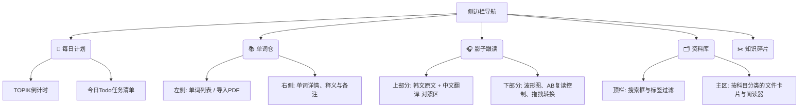

# 韩语学习工具箱 (TOPIK Study Hub) 设计方案

基于您提供的复习资料目录结构和核心需求，我为您设计了一款专属的韩语学习桌面端工具箱。由于您本地已经有 Python 脚本 (`单词表转文本PDF工具.py`) 运行环境，推荐使用 **Python + PyQt/PySide6** 的技术栈，这样可以完美复用您现有的 OCR 逻辑。

以下是整体架构与功能模块设计：

---

## 1. 核心功能模块设计

### 📚 模块一：智能单词仓 (Vocabulary Module)
**痛点解决：** 解决图片/扫描版 PDF 单词表无法复制、难以标记的问题。
*   **一键 OCR 转换中心：** 为您现有的 `单词表转文本PDF工具.py` 提供图形化界面，支持批量拖拽 PDF 甚至零散的 `.png` 图片（如 `语法块.png`）进行转写。
*   **交互式词汇表：** 转写后的文字不再仅仅是 PDF，而是可以导入工具箱的内置数据库中，形成支持**高亮、添加备注、复制**的电子词汇表。
*   **生词本与导出：** 学习时遇到的重点单词可以一键添加到“生词本”，并支持导出为 Anki 牌组格式。

### 🎧 模块二：影子跟读与转换器 (Shadowing & Converter)
**痛点解决：** 解决 OBS 录制的 mkv 转换繁琐，以及跟读时音频与双语文本视线割裂的问题。
*   **内置格式转换器：** 拖拽 OBS 录制好的 mkv 视频文件，后台调用 `FFmpeg` 瞬间自动提取并转换为 mp3，直接存入指定的听力文件夹。
*   **沉浸式跟读播放器：** 
    *   **三分屏界面：** 顶部/左侧显示韩语原文和中文翻译（支持载入 `.pdf` 听写文本，如 `91届TOPIK中高级听力-原文听写.pdf` 或 txt/lrc 格式），右侧/底部为播放控制台。
    *   **AB 循环复读：** 支持快捷键设置 A-B 点循环，方便死磕听不懂的长难句。
    *   **语速调节：** 0.5x 到 1.5x 变速播放，适应不同阶段的跟读需求。

### 🗂️ 模块三：TOPIK 专属资料库 (Material Vault)
**痛点解决：** 资料随处堆放，查找历届真题、分类练习（阅读、听力、写作）费时费力。
*   **虚拟目录管理：** 自动映射本地的 `写作`、`单词`、`听力`、`阅读` 文件夹。
*   **标签与检索：** 为 PDF 资料打标签（如 `#真题`, `#冲刺班`, `#105届`）。支持全文搜索功能（利用 `PyMuPDF` 提取文本建索引），输入关键词瞬间定位到相关讲义。
*   **阅读进度记忆：** 内置轻量级 PDF 阅读器，记住您上次阅读《写作讲义》或《阅读语法总结》的具体页码。

### ✂️ 模块四：碎片知识点收集 (Snippet Manager)
**痛点解决：** 零碎截图（如 `19题必备副词.jpg`, `27题选项高频词.png`）难以系统性回顾。
*   **全局快捷键截图：** 随时按下自定义快捷键截取屏幕上的知识点。
*   **截图瀑布流画廊：** 截图自动保存至资料库的专属板块，并以瀑布流形式展示。
*   **图像文字提取 (OCR)：** 点击任意知识点截图，可调用 Tesseract OCR 提取图中的韩语/中文文本，方便复制到笔记软件。

### 📅 模块五：每日日程与学习计划 (Daily Planner)
**痛点解决：** 学习任务缺乏规划，导致资料多但无从下手，进度难以追踪。
*   **轻量级 Todo List：** 每天规划好要背多少单词、跟读哪篇听力、做几道阅读题，完成任务后勾选打卡。
*   **模块联动追踪：** 与其他模块打通。比如今天在“影子跟读”模块听了30分钟，在“单词仓”记了50个词，系统自动将数据同步至日程面板。
*   **备考倒计时：** 首页固定展示第 109 届 TOPIK 考试倒计时卡片，增加学习紧迫感与仪式感。

---

## 2. 技术栈建议

*   **前端界面 (GUI)**: 推荐 `PySide6` (Qt for Python)。它性能极佳，适合开发包含 PDF 渲染、多媒体播放和本地文件管理的桌面应用。
*   **后端逻辑**: 纯 `Python 3`。
*   **多媒体处理**: `PyQt6.QtMultimedia` (自带播放器) + 外部调用 `ffmpeg` (用于 mkv 转 mp3)。
*   **OCR 引擎**: 沿用现有的 `Tesseract-OCR` + `PyMuPDF` (处理 PDF)。
*   **本地数据库**: `SQLite` (轻量级，无需额外配置，适合存储单词本、计划表、文件标签和截图元数据)。

---

## 3. 界面布局草图 (UI/UX)

## 下一步行动建议

由于这是一个完整的系统工程，我们可以采用**敏捷开发**的方式，逐个模块击破。
建议从您最迫切的功能开始，比如：
1. 先实现 **每日日程首页 (UI)** 和 **影子跟读播放器 + mkv转mp3功能**？
2. 或者是先将 **OCR 脚本** 封装成带有 UI 界面的工具？

您希望我们先从哪一个模块开始编写代码呢？
