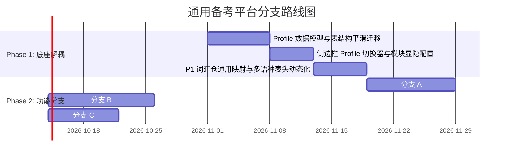

# 基于 TOPIK Study Hub 架构基座的通用化重构与未来分支发展规划

> [!NOTE]
> 本文档为**架构可行性与分支演进分析报告**（严格遵循「仅做规划分析，不自动执行代码落地」约定）。旨在系统性评估在当前优雅的 PySide6 + SQLite + Linear 设计规范之上，如何解耦韩语硬绑定，平滑升级为「通用多科目备考工作台」，并延伸三大前沿分支。

---

## 1. 现状资产评估与重构可行性

### 1.1 当前项目的核心高质量资产
当前代码库经过精心打磨，沉淀了极具价值的工程资产：
1. **统一的设计语言与交互体验**：基于 `DESIGN.md`（Linear 风格，10 条视觉铁律、深浅对比度、像素级对齐排版、行内 Banner、Toast、无侵入式反馈）。
2. **纯净的本地优先与单进程架构**：以 SQLite 为单一事实源，零外部依赖常驻服务，极低内存与极速启动。
3. **两层数据隔离模式 (Two-layer architecture)**：
   - 第一层（只读/可重建）：文件索引、原始 TSV 词表、音频文件；
   - 第二层（用户资产/高价值保护）：笔记、三态判词、跟读记录、碎片标注。
4. **成熟的闭环指标体系**：基于活动日志 `activity_log` 的连续天数、时长、周回顾、待专攻队列（〔2026-10-09〕Anki 导出已移除，不再是资产）

### 1.2 为什么非常适合重构为通用备考平台？
当前代码除部分数据表字段（如 `hanja`、`example_kr`）和 TOPIK 专有名词（如“第 109 届 TOPIK 考试”）有较强特定业务色彩外，**底层五个模块本质上是一个通用的备考认知飞轮**：
- **P0 规划与回顾**：时间跟踪、目标倒计时、行为看板（任何考试通用）。
- **P1 记忆强化仓**：过词筛选 + 专攻复习 + 笔记沉淀（任何外语词汇、专业法条、概念术语通用）。
- **P2 音视频沉浸与跟读**：分句复习、A/B 循环、影子录音对比（雅思、托福、日语听力与口语通用）。
- **P3 本地只读资料库**：目录监控、标签化、增量索引、阅读进度记忆（论文、真题 PDF、教材通用）。
- **P4 视觉知识碎片**：截图沉淀、归档检索、物理文件双向联动（错题截图、思维导图、板书通用）。

---

## 2. 核心重构方案：从 TOPIK 专有到 Universal Exam Hub

```mermaid
flowchart TD
    App[Universal Study Hub App] --> ProfileMgr[Profile 上下文管理器]
    ProfileMgr --> P_Topik[Profile: TOPIK II (韩语)]
    ProfileMgr --> P_Ielts[Profile: IELTS (英语)]
    ProfileMgr --> P_Law[Profile: 国家法律职业资格 (法考)]

    subgraph DataLayer [统一数据与存储层 (SQLite + FileSystem)]
        DB[(study_hub.db<br/>含 profile_id 分区)]
        Dir1[data/snippets/{profile_id}/]
        Dir2[data/recordings/{profile_id}/]
    end

    ProfileMgr --> DataLayer

    subgraph Modules [动态可插拔模块 (Sidebar 按配置呈现)]
        M0[P0 计划与指标]
        M1[P1 记忆仓 / 术语库]
        M2[P2 影音与跟读 (可选)]
        M3[P3 本地资料库]
        M4[P4 知识碎片]
        M5[P5 设置与备份]
    end

    ProfileMgr -.配置驱动显隐.-> Modules
```

### 2.1 数据模型重构（Schema 迁移策略）

在现有单库 `data/study_hub.db` 的基础上，增加 `profiles` 基础配置表，并向核心业务表注入 `profile_id`：

```sql
-- 科目/考试配置文件
CREATE TABLE IF NOT EXISTS profiles (
    id TEXT PRIMARY KEY,               -- 如 'topik', 'ielts', 'bar_exam'
    name TEXT NOT NULL,               -- 如 'TOPIK II 中高级', '雅思 7.5', '法考客观题'
    category TEXT NOT NULL,           -- 'language' | 'professional' | 'academic'
    exam_date TEXT,                   -- 'YYYY-MM-DD'
    exam_name TEXT,                   -- '第 109 届 TOPIK' / '2027 雅思'
    material_root_path TEXT,          -- 该科目专属的本地资料根目录
    enabled_modules TEXT NOT NULL,    -- JSON 数组: ["planner", "vocab", "shadowing", "vault", "snippets"]
    vocab_schema_preset TEXT,         -- 'korean' | 'japanese' | 'english' | 'general_term'
    created_at TEXT NOT NULL
);
```

#### 词汇仓 (P1) 字段通用化抽象
将现有的 `words` 表字段升级为语义中立的通用模型，兼顾多语种与专业考试概念：

| 原 TOPIK 字段 | 通用抽象字段 | 英语预置映射 | 日语预置映射 | 韩语预置映射 | 专业概念/法考映射 |
|---|---|---|---|---|---|
| `word` | `term` | 英文单词 | 日语单词/汉字 | 韩语单词 | 法律概念/法条名 |
| `hanja` | `phonetic_or_reading` | 国际音标 (IPA) | 假名读音 (振假名) | 汉字词 (Hanja) | 关键词/简称 |
| `pos` | `category_pos` | 词性 (n., v., adj.) | 词性 | 词性 | 部门法 (刑法/民法等) |
| `meaning` | `definition` | 中文释义 | 中文释义 | 中文释义 | 核心法理/构成要件 |
| `example_kr` | `example` | 英文例句 | 日文例句 | 韩文例句 | 经典案情/法条原文 |
| `example_cn` | `example_translation` | 例句中文翻译 | 例句中文翻译 | 例句中文翻译 | 案例解析/法条释义 |

> **平滑迁移保证**：原有 TOPIK 数据自动作为默认 Profile (`topik`)，启动时运行 `PRAGMA user_version` 增量迁移脚本，无缝将现有数据关联至该 Profile，零破坏升级。

### 2.2 资料与目录隔离规范
为保持本地文件系统清晰：
- 每个 Profile 单独配置 `material_root_path`。切换 Profile 时，P3 资料库仅读取属于当前 Profile 的路径；
- 碎片与剪贴板图片按 Profile 分目录归档：`data/snippets/{profile_id}/`；
- 跟读录音隔离：`data/recordings/{profile_id}/`；
- 原则不变：**用户外部资料永远只读**，删除仅走回收站并只限于第一层索引清理。

---

## 3. 未来三大进阶分支发展方向可行性分析

根据访谈偏好，本系统可在完成通用底座后，向以下三大高收益技术方向分支演进：

```mermaid
mindmap
  root((Universal Study Hub))
    底座架构 (Universal Core)
      多 Profile 隔离
      通用术语/词汇仓
      模块可插拔引擎
      资料与碎片隔离
    分支 A: 本地与 BYOK AI 认知增强
      Ollama 本地 / API 密钥直连
      自动拆解难句与词根助记
      Whisper 本地语音对齐与跟读打分
    分支 B: 模考与错题本引擎
      结构化试卷导入 (JSON / Markdown)
      仿真倒计时模考面板
      自动批改与错题沉淀至复习流
    分支 C: 无服务便携漫游与离线生态
      WebDAV / 本地网盘双向轻同步
      静态网页版 (HTML+SQLite WASM) 离线复习包
      单文件离线便携模式
```

---

### 分支 A：本地化与 BYOK AI 认知增强 (AI-Augmented Engine)

#### 1. 核心定位
**“绝不做无休止的闲聊机器人，只做直击学习痛点的离线增强算力。”** 坚持用户自备密钥 (BYOK) 或本地运行大模型 (Ollama)，绝不在后台偷跑流量。

#### 2. 三大核心落地点
- **单词/术语智能助记与造句拆解**：
  在 P1 专攻模式中，当某个单词反复标红（“不认识”）时，提供一键「AI 助记」按键：调用模型基于词根词缀、语境联想或谐音生成助记卡，自动提取经典例句。
- **本地 Whisper 影子跟读对齐与流利度比对**：
  在 P2 影子跟读中，利用本地轻量 `faster-whisper`（完全离线）：
  - 自动将用户录音转写为文字；
  - 与参考音轨的文本进行 Levenshtein 文本相似度对比，高亮读错、漏读、吞音的词汇；
  - 彻底将“靠耳朵盲听对比”升级为“音画字对照评估”。
- **长难句/真题深度剖析**：
  在 P3/P4 选中文本时，快速弹出结构解析（主谓宾划分、考点语法标注）。

---

### 分支 B：真题模拟自测与错题本闭环引擎 (Mock Exam & Error Book)

#### 1. 核心定位
**从“被动阅读资料与零散过词”升级为“高仿真测验与结构化错题闭环”。** 专门针对各大资格考试及外语考级的客观题与综合题。

#### 2. 模块扩展形态 (P6: ExamView)
- **试卷格式**：支持轻量纯文本/Markdown/JSON 格式导入真题试卷（如包含题干、选项、正确答案、考点标签、音频时间戳）。
- **实战模考交互**：
  - 全真时间倒计时条，答题卡右侧抽屉；
  - 支持快捷键盲操（`A`/`B`/`C`/`D` 或 `1`/`2`/`3`/`4`）；
  - 听力音频根据题号自动跳播，模拟考场播放节奏。
- **错题本闭环 (Error Ledger)**：
  - 提交后自动计算得分与错题清单；
  - 错题直接一键进入 P0「今日复习任务」，并支持与 P3 真题原卷页码、P4 知识碎片进行超链接绑定；
  - 提供“重刷错题模式”，直到错误次数归零。

---

### 分支 C：无服务多端便携同步与离线生态 (Zero-Server Multi-Device Ecosystem)

#### 1. 核心定位
**坚守无服务器哲学，但打破单机桌面的物理限制。**

#### 2. 演进路径
- **WebDAV / 坚果云 / OneDrive 透明增量同步**：
  - 在设置中提供 WebDAV 挂载或网盘目录备份；
  - 启动时校验远程与本地数据库 Hash，退出时自动将最新的增量快照和 `data/snippets/` 上传；
  - 提供冲突防呆机制（本地先自动打时间戳备份，再拉取最新，绝不丢失数据）。
- **手机离线复习包导出 (Static Web Generator)**：
  - 一键将当天的“待专攻单词”或“待复习错题”导出为一个独立的静态 HTML 单页（包含内联 CSS、JS 和音频 Base64/相对路径）；
  - 传到手机微信/浏览器即可像原生 App 一样直接划卡复习，复习结果生成一个迷你 JSON 码，扫码或粘贴回电脑端完成合并。

---

## 4. 架构重构演进路线（分期规划建议）

若未来启动该方向的演进，建议分为以下清晰的实施节奏：



---

## 5. 结论与总结

1. **代码基座的扩展性极佳**：当前架构逻辑清晰、分层严格、UI 组件解耦良好（遵循 Linear 规范）。向「通用备考平台」演进只需要重构**上下文绑定层（引入 Profile）**和**抽象 P1 的领域词表结构**，完全不需要推翻现有 PySide6 界面架构。
2. **分支发展价值巨大**：
   - 纵向多语种/多学科扩展让这套工具不再局限于某一届单一考试；
   - 本地 Whisper 影子对齐与真题错题本闭环，能将日常备考从“散装文件”真正提升为“专业数字化私塾”。
3. **完全遵循既定约定**：此阶段仅做全面规划与可能性论证，**未变更任何生产业务代码**。
